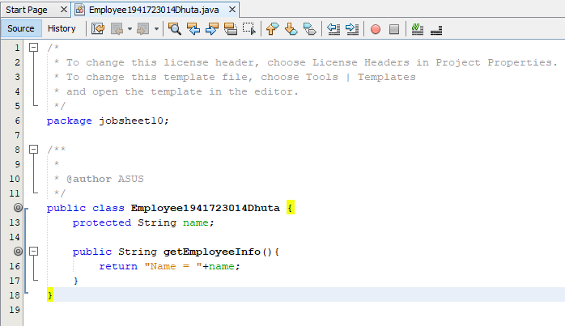
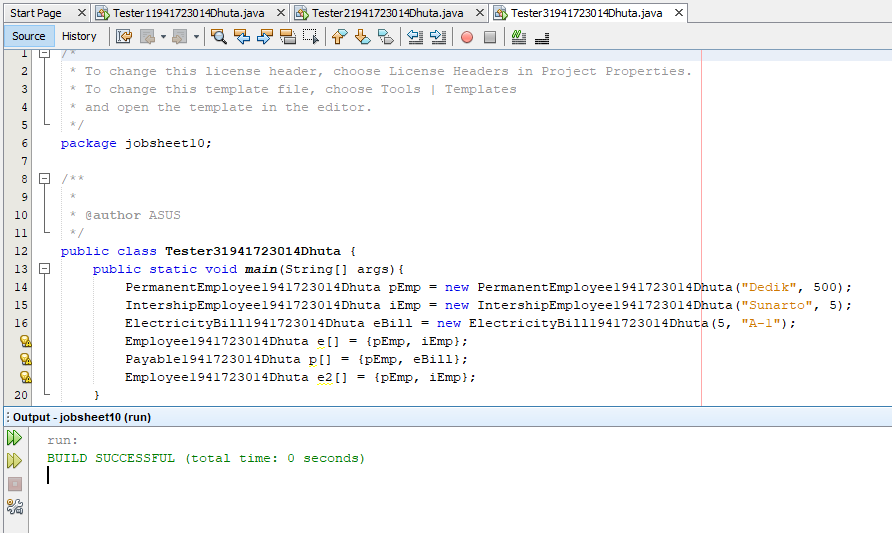
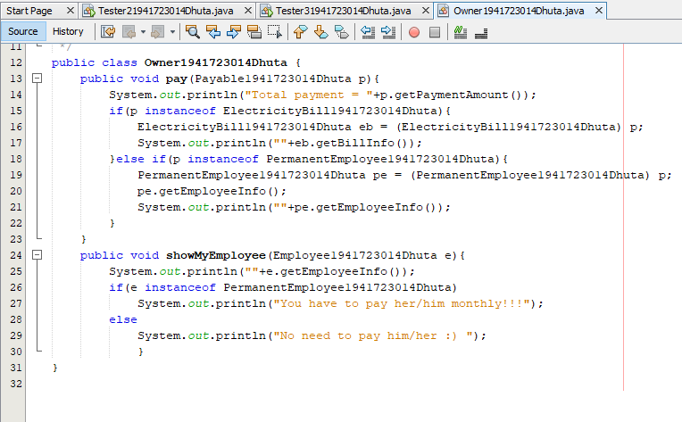

# Laporan #10 - Pengantar Konsep PBO

# Polimorpism

## Kompetensi

	Setelah melakukan percobaan pada jobsheet ini, diharapkan mahasiswa mampu: 
	a. Memahami konsep dan bentuk dasar polimorfisme
	b. Memahami konsep virtual method invication 
	c. Menerapkan polimorfisme pada pembuatan heterogeneous collection 
	d. Menerapkan polimorfisme pada parameter/argument method 
	e. Menerapkan object casting untuk meng-ubah bentuk objek
  

## Ringkasan Materi

### Polimorfisme
Polimorfisme merupakan kemampuan suatu objek untuk memiliki banyak bentuk. Penggunaan polimorfisme yang paling umum dalam OOP terjadi ketika ada referensi super class yang digunakan untuk merujuk ke objek dari sub class. Dengan kata lain, ketika ada suatu objek yang dideklarasikan dari super class, maka objek tersebut bisa diinstansiasi sebagai objek dari sub class.

### Virtual method Invocation
Virtual method invocation terjadi ketika ada pemanggilan overriding method dari suatu objek polimorfisme. Disebut virtual karena antara method yang dikenali oleh compiler dan method yang dijalankan oleh JVM berbeda.

### Heterogeneous Collection 
Dengan adanya konsep polimorfisme, maka variabel array bisa dibuat heterogen. Artinya di dalam array tersebut bisa berisi berbagai macam objek yang berbeda.

### Polymorphic Argument 
Polimorfisme juga bisa diterapkan pada argument suatu method. Tujuannya agar method tersebut bisa menerima nilai argument dari berbagai bentuk objek.

### Operator instanceof
Operator instanceof bisa digunakan untuk mengecek apakah suatu objek merupakan hasil instansiasi dari suatu class tertentu. Hasil dari instanceof berupa nilai boolean. 

### Object Casting 
Casting objek digunakan untuk mengubah tipe dari suatu objek. Jika ada suatu objek dari subclass kemudian tipenya diubah ke superclass, maka hal ini termasuk ke upcasting. Proses downcasting sering disebut juga sebagai explicit casting, karena bentuk tujuan dari casting harus dituliskan dalam tanda kurung, di depan objek yang akan di-casting.

## Studi Kasus

### Percobaan 1 (Bentuk dasar polimorfisme)

Employes

IPayable

IntershipEmployes

PermanentEmployes

ElectricityBill

Tester1

## Pertanyaan

	1. Class apa sajakah yang merupakan turunan dari class Employee?
	Jawab:
	Turunan dari class Employee ialah class IntershipEmployee dan class PermanentEmployee

	2. Class apa sajakah yang implements ke interface Payable?
	Jawab:
	Class yang mengimplementasi Interface IPayable ialah class ElectricityBill dan class PermanentEmployee

	3. Perhatikan class Tester1, baris ke-10 dan 11. Mengapa e, bisa diisi dengan objek pEmp (merupakan objek dari class PermanentEmployee) dan objek iEmp (merupakan objek dari class InternshipEmploye)?
	Jawab:
	Objek tersebut dibuat dari class yang merupakan turunan dari class Employee

	4. Perhatikan class Tester1, baris ke-12 dan 13. Mengapa p, bisa diisi dengan objek pEmp (merupakan objek dari class PermanentEmployee) dan objek eBill (merupakan objek dari class ElectricityBill)?
	Jawab:
	Karena pada class PermanentEmployee mengimplementasikan Interface IPayable dan class ElectricityBill

	5. Coba tambahkan sintaks: 
	p = iEmp;      
	e = eBill;
	pada baris 14 dan 15 (baris terakhir dalam method main) ! Apa yang menyebabkan error?
	Jawab:
	Yang menyebabkan error pada syntaks tersebut ialah pada objek p tidak diwariskan atau diturunkan oleh class IntershipEmployee

	6. Ambil kesimpulan tentang konsep/bentuk dasar polimorfisme!
	Jawab:
	merupakan suatu konsep yang menyatakan sesuatu yang sama dapat memiliki berbagai bentuk dan perilaku berbeda

link Employes : [ini  link ke kode program](../../src/10_Polimorpism/Employee1941723014Dhuta.java) 
link IPayable : [ini  link ke kode program](../../src/10_Polimorpism/Payable1941723014Dhuta.java) 
link IntershipEmployes : [ini  link ke kode program](../../src/10_Polimorpism/IntershipEmployee1941723014Dhuta.java) 
link PermanentEmployes : [ini  link ke kode program](../../src/10_Polimorpism/PermanentEmployee1941723014Dhuta.java) 
link ElectricityBill : [ini  link ke kode program](../../src/10_Polimorpism/ElectricityBill1941723014Dhuta.java) 
link Tester1 : [ini  link ke kode program](../../src/10_Polimorpism/Tester11941723014Dhuta.java)

### Percobaan 2 (Virtual method invocation)

Tester2

## Pertanyaan

	1. Perhatikan class Tester2 di atas, mengapa pemanggilan e.getEmployeeInfo() pada baris 8 dan pEmp.getEmployeeInfo() pada baris 10 menghasilkan hasil sama?
	Jawab:
	Objek e dideklarasikan e sama dengan pEmp sehingga dapat memangil isi dari getEmployeeInfo dari class PermanentEmployee, dan juga PermanentEmployee merupakan turunan dari Employee

	2. Mengapa pemanggilan method e.getEmployeeInfo() disebut sebagai pemanggilan method virtual (virtual method invication), sedangkan pEmp.getEmployeeInfo() tidak? 
	Jawab:
	Method yang dipanggil berasal dari class PermanentEmployee sedangkan pEmp merupakan objek dari class PermanentEmployee. Sehingga tidak dapat disebut pemanggilan method virtual

	3. Jadi apakah yang dimaksud dari virtual method invocation? Mengapa disebut virtual? 
	Jawab:
	Dipanggil virtual karena tidak berasal dari class tersebut namun memiliki rangka yang sama sehingga dapat dipanggil

	
	
link Tester2: [ini  link ke kode program](../../src/10_Polimorpism/Tester21941723014Dhuta.java)

### Percobaan 3 (Heterogenous Collection)

Tester3

## Pertanyaan

	1. Perhatikan array e pada baris ke-8, mengapa ia bisa diisi dengan objek-objek dengan tipe yang berbeda, yaitu objek pEmp (objek dari PermanentEmployee) dan objek iEmp (objek dari InternshipEmployee)?
	Jawab:
	Karena objek iEmp dan pEmp merupakan objek dari class turunan Employee sehingga dapat diisi pada objek yang dibuat oleh class parent yaitu Employee

	2. Perhatikan juga baris ke-9, mengapa array p juga biisi dengan objekobjek dengan tipe yang berbeda, yaitu objek pEmp (objek dari PermanentEmployee) dan objek eBill (objek dari ElectricityBilling) ?
	Jawab:
	Karena pada class ElectricityBill dan class PermanentEmployee menmgimplementasi Interface IPayable sehingga pada objek p dapat memanggil objek eBill dan pEmp

	3. Perhatikan baris ke-10, mengapa terjadi error?
	Jawab:
	Class Employee tidak ada relasi sama sekali oleh class ElectricityBill

link Tester3: [ini  link ke kode program](../../src/10_Polimorpism/Tester31941723014Dhuta.java)

### Percobaan 4 (Argumen polimorfisme, instanceod dan casting objek)

Owner

Tester4

## Pertanyaan
	1. Perhatikan class Tester4 baris ke-7 dan baris ke-11, mengapa pemanggilan ow.pay(eBill) dan ow.pay(pEmp) bisa dilakukan, padahal jika diperhatikan method pay() yang ada di dalam class Owner memiliki argument/parameter bertipe Payable? Jika diperhatikan lebih detil eBill merupakan objek dari ElectricityBill dan pEmp merupakan objek dari PermanentEmployee?
	Jawab:
	Karena kedua class tersebut mengimplementasikan Interface IPayable sehingga dapat dipanggil melalui method pay()

	2. Jadi apakah tujuan membuat argument bertipe Payable pada method pay() yang ada di dalam class Owner?
	Jawab:
	Agar dapat menanggil objek yang mengimplementasi Interface IPayable tanpan harus membuat method yang berulang-ulang

	3. Coba pada baris terakhir method main() yang ada di dalam class Tester4 ditambahkan perintah ow.pay(iEmp);
	Mengapa terjadi error? 		
	Jawab:
	Karena pada class IntershipEmployee tidak mengimplementasi interface IPayable sehingga tidak dapat diisi pada pemanggilan method

	4. Perhatikan class Owner, diperlukan untuk apakah sintaks p instanceof ElectricityBill pada baris ke-6 ?
	Jawab:
	Untuk memeriksa apakah ElectricityBill mengimplementasi Ipayable

	5. Perhatikan kembali class Owner baris ke-7, untuk apakah casting objek disana (ElectricityBill eb = (ElectricityBill) p) diperlukan ? Mengapa objek p yang bertipe Payable harus di-casting ke dalam objek eb yang bertipe ElectricityBill ?
	Jawab:
	Untuk mengembalikan ke instansiasi, sehingga dapat memanggil method getBillInfo() yang ada di class ElectricityBill saja

link Owner: [ini  link ke kode program](../../src/10_Polimorpism/Owner1941723014Dhuta.java) 
link Tester4: [ini  link ke kode program](../../src/10_Polimorpism/Tester41941723014Dhuta.java)

### Tugas

Zombie

IDestroyable

Barrier

Plan

WalkingZombie

JumpingZombie

Tester

link Zombie: [ini  link ke kode program](../../src/10_Polimorpism/Tugas/Zombie1941723014Dhuta.java) 
link IDestroyable: [ini  link ke kode program](../../src/10_Polimorpism/Tugas/IDestroyable1941723014Dhuta.java) 
link Barrier: [ini  link ke kode program](../../src/10_Polimorpism/Tugas/Barrier1941723014Dhuta.java) 
link Plan: [ini  link ke kode program](../../src/10_Polimorpism/Tugas/Plant1941723014Dhuta.java) 
link WalkingZombie: [ini  link ke kode program](../../src/10_Polimorpism/Tugas/WalkingZombie1941723014Dhuta.java) 
link JumpingZombie: [ini  link ke kode program](../../src/10_Polimorpism/Tugas/JumpingZombie1941723014Dhuta.java) 
link Tester: [ini  link ke kode program](../../src/10_Polimorpism/Tugas/Tester51941723014Dhuta.java)

## Kesimpulan

Polimorpism adalah objek yang kita gunakan ini bisa berubah dengan kondisi yang terjadi. Jadi kita tidak perlu menulis kode program yang panjang

## Pernyataan Diri

	Saya menyatakan isi tugas, kode program, dan laporan praktikum ini dibuat oleh saya sendiri. Saya tidak melakukan plagiasi, kecurangan, menyalin/menggandakan milik orang lain.

	Jika saya melakukan plagiasi, kecurangan, atau melanggar hak kekayaan intelektual, saya siap untuk mendapat sanksi atau hukuman sesuai peraturan perundang-undangan yang berlaku.

Ttd,

***(Dhuta Pamungkas Ibnusiqin)***