# Laporan #11 - Pengantar Konsep PBO

# GUI (Graphical User Interface)	

## Kompetensi

	Setelah menyelesaikan lembar kerja ini mahasiswa diharapkan mampu: 
	1. Membuat aplikasi Graphical User Interface sederhana dengan bahasa pemrograman java; 
	2. Mengenal komponen GUI seperti frame, label, textfield, combobox, radiobutton, checkbox, textarea, menu, serta table; 
	3. Menambahkan event handling pada aplikasi GUI.
  

## Ringkasan Materi

### GUI 
Untuk membuat aplikasi Java berbasis GUI, kita butuh sebuah frame atau applet untuk media eksekusi aplikasi GUI. Pada Java sebuah frame dapat diwakili oleh sebuah kelas, yaitu JFrame. Melalui kelas JFrame kita bisa mendesain tampilan Java GUI sesuai kebutuhan. Beberapa method yang penting dan sering dipakai yaitu:
	a. setSize() : menentukan ukuran frame  
	b. setLocation() : menentukan lokasi frame pada bagian pojok kiri atas  
	c. setVisible() : menampilkan frame  
	d. setDefaultCloseOperation() : menentukan operasi ketika frame ditutup  
	e. setLocationRelativeTo() : menentukan lokasi frame relatif terhadap parameter komponen yang diinputkan  
	f. Pack() : menentukan secara otomatis ukuran frame sesuai komponen yang dimasukkan.  
Java Swing merupakan bagian dari JFC (Java Foundation Classes) yang menyediakan API untuk menangani hal yang berkaitan dengan GUI bagi program Java.  Kita bisa membedakan komponen Swing dengan komponen AWT, di mana pada umumnya kelas-kelas yang berada dalam komponen Swing diawali dengan huruf J, misal: JButton, JLabel, JTextField, JRadioButton.

### Praktikum

### Percobaan 1 JFrame HelloGUI 

HelloGUI

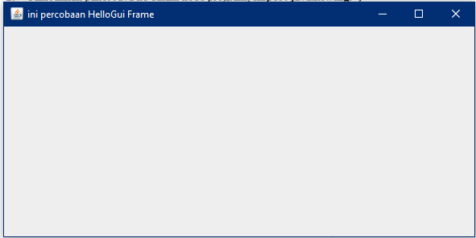

MyInputForm

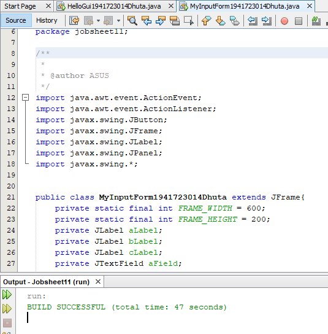

link HelloGUI : [ini  link ke kode program](../../src/11_ID_GUI/jobsheet11/HelloGui1941723014Dhuta.java) 
link MyInputForm : [ini  link ke kode program](../../src/11_ID_GUI/jobsheet11/MyInputForm1941723014Dhuta.java)

### Percobaan 2  Menangani Input Pada GUI 

MyInputForm

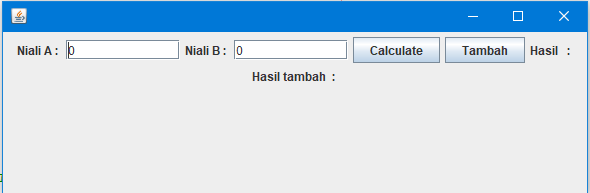

## Pertanyaan

	Modifikasi kode program dengan menambahkan JButton baru untuk melakukan fungsi perhitungan penambahan, sehingga ketika button di klik (event click) maka akan menampilkan hasil penambahan dari nilai A dan B.
	Jawab:

link MyInputForm: [ini  link ke kode program](../../src/11_ID_GUI/percobaan2/MyInputForm1941723014.java)

### Percobaan 3 Manajemen Layout 

BorderLayoutDemo

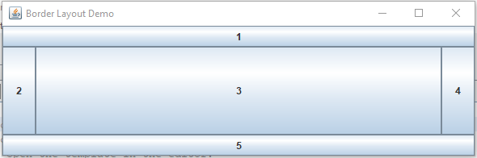

GridLayoutDemo

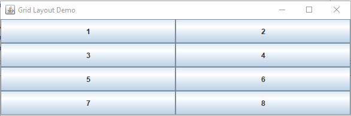

BoxLayoutDemo

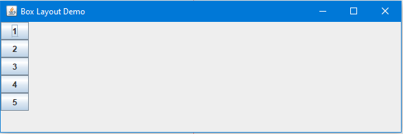

## Pertanyaan

	a. Apa perbedaan dari Grid Layout, Box Layout dan Border Layout? 
	Jawab:
	Perbedaanya terdapat pada hasil layout. Border layout membuat box menyesuaikan border, grid layout membuat tiap - tiap box sama persis dan memenuhi frame, box layout membuat box biasa tanpa terpengaruh panjang frame

	b. Apakah fungsi dari masing-masing kode berikut? 
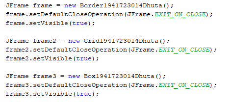
	Jawab:
	Fungsinya ialah mendeklarasikan objek frame sesuai class yang dibuat

link Border: [ini  link ke kode program](../../src/11_ID_GUI/percobaan3/Border1941723014Dhuta.java) 
link Box: [ini  link ke kode program](../../src/11_ID_GUI/Box1941723014Dhuta.java) 
link Grid: [ini  link ke kode program](../../src/11_ID_GUI/Grid1941723014Dhuta.java) 
link LayoutGUI: [ini  link ke kode program](../../src/11_ID_GUI/LayoutGUI1941723014Dhuta.java) 
link ManajemenLayout: [ini  link ke kode program](../../src/11_ID_GUI/ManajemenLayout1941723014Dhuta.java)

### Percobaan 4 Membuat GUI Melalui IDE Netbeans 

Tampil

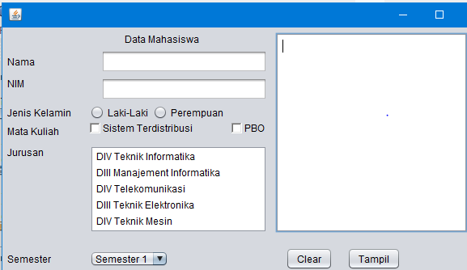

## Pertanyaan
	a. Apakah fungsi dari masing-masing kode berikut? 
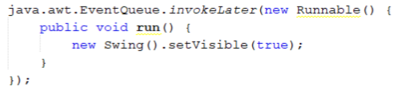
	Jawab:
	Fungsi kode program diatas ialah menampilkan sebuah form baru, pada pada form tersebut akan muncul sebuah message box ketika button tampil diklik

	b. Mengapa pada bagian logika checkbox dan radio button digunakan multiple if?
	Jawab:
	Karena pilihan yang tersedia tidak hanya satu untuk matakuliah

	c. Lakukan modifikasi pada program untuk melakukan menambahkan inputan berupa alamat dan berikan fungsi pemeriksaan pada nilai Alamat tersebut jika belum diisi dengan menampilkan pesan peringatan.
	Jawab: 
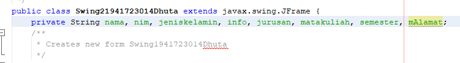

link Swing form: [ini  link ke kode program](../../src/11_ID_GUI/perconbaan4/Swing1941723014Dhuta.form) 
link Swing java: [ini  link ke kode program](../../src/11_ID_GUI/Swing1941723014Dhuta.java) 
link Swing2: [ini  link ke kode program](../../src/11_ID_GUI/Swing21941723014Dhuta.java)

### Percobaan 5 JTabPane, JTtree, JTable

Hasil Form PercobaanGUI

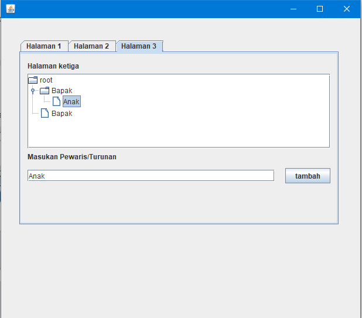

PercobaanGUI

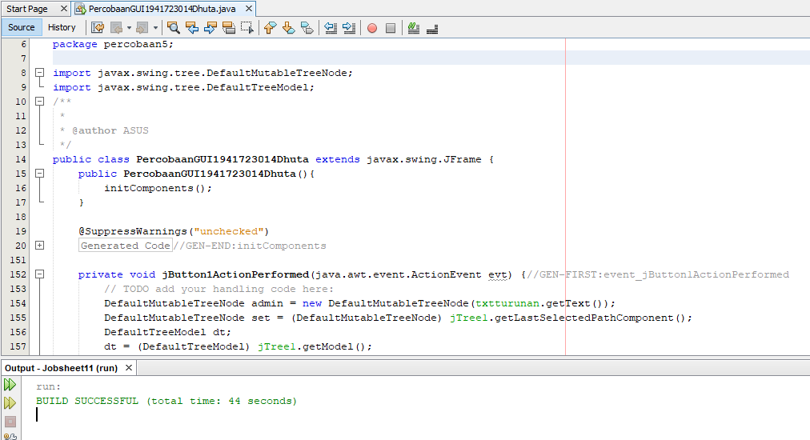

## Pertanyaan

	a. Apa kegunaan komponen swing JTabPane, JTtree, pada percobaan 5?
	Jawab:
	Kegunaan komponen TabPane pada swing untuk membuat tab pada Frame atau GUI. Kegunaan komponen swing Tree pada GUI untuk membuat sebuah menu kategori atau folder yang memiliki subfolder

	b. Apa kegunaan komponen swing JTabPane, JTtree, pada percobaan 5?
	Jawab:

link PercobaanGUI: [ini  link ke kode program](../../src/11_ID_GUI/percobaan5/PercobaanGUI1941723014Dhuta.java)

## Assigment

Hasil Kalkulator

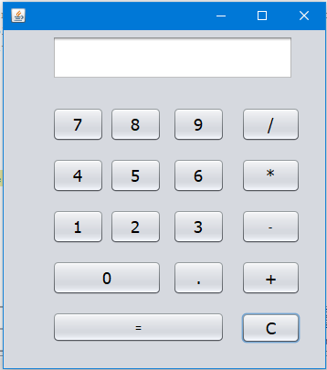

link Kalkulator: [ini  link ke kode program](../../src/11_ID_GUI/Assigment/Calculate1941723014Dhuta.java)

## Kesimpulan

GUI membuat tampilan pada java agar lebih bagus dan bisa digunakan dengan mudah

## Pernyataan Diri

	Saya menyatakan isi tugas, kode program, dan laporan praktikum ini dibuat oleh saya sendiri. Saya tidak melakukan plagiasi, kecurangan, menyalin/menggandakan milik orang lain.

	Jika saya melakukan plagiasi, kecurangan, atau melanggar hak kekayaan intelektual, saya siap untuk mendapat sanksi atau hukuman sesuai peraturan perundang-undangan yang berlaku.

Ttd,

***(Dhuta Pamungkas Ibnusiqin)***