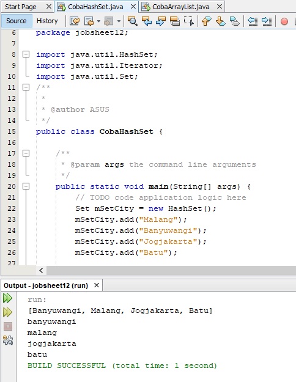
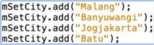
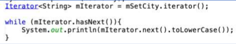
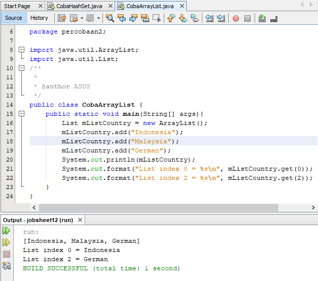
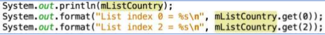
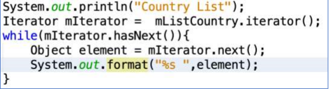
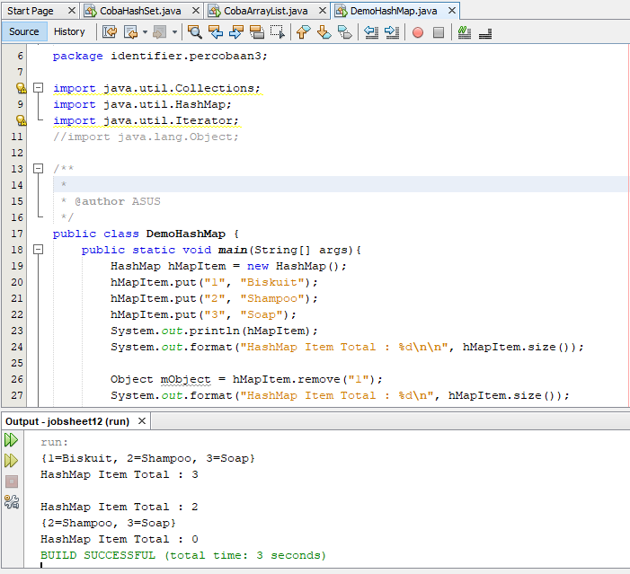
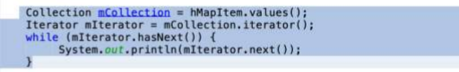
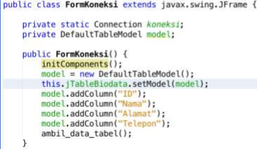

# Laporan #12 - Pengantar Konsep PBO

# Collection (List, Set, Map) dan Database	

## Tujuan Pembelajaran

	1 Memahami cara penyimpanan objek menggunakan Collection dan Map. 
	2 Mengetahui pengelompokan dari Collection. 
	3 Mengetahui perbedaan dari interface Set, List dan Map. 
	4 Mengetahui penggunaan class-class dari interface Set, List, dan Map. 
	5 Memahami koneksi database menggunakan JDBC dan JDBC API
  

## Ringkasan Materi

### Collection

Collection Adalah suatu objek yang bisa digunakan untuk menyimpan sekumpulan Objek. Collection menyimpan element bertipe Objek, sehingga berbagai type Objek disimpan dalam Collection.  Class-class mengenai Collection tergabung dalam Java Collection Framework. Class-class Collection diletakkan dalam package java.util dan mempunyai dua interface utama yaitu Collection

### a. Set 

Set mengikuti model himpunan, dimana objek/anggota yang tersimpan dalam Set harus unik. Urutan maupun letak dari anggota tidak penting, hanya keberadaan anggota saja yang penting. Kelas konkrit yang mengimplementasikan Set harus memastikan bahwa tidak terdapat elemen duplikat yang dapat ditambahkan ke dalam set. Yaitu, tidak terdapat dua elemen e1 dan e2 yang berada di dalam set yang membuat e1.equals(e2) bernilai true. ClassClass yang mengimplementasikan interface Set adalah HashSet.

HashSet dapat digunakan untuk menyimpan elemen-elemen bebas-duplikat. Kelas HashSet merupakan suatu kelas konkrit yang mengimplementasikan Set. Pembuatan objek HashSet adalah sebagai berikut: 

Set <nama_objek_HashSet> = new HashSet(); 

### b. List

List digunakan untuk menyimpan sekumpulan objek berdasarkan urutan masuk (ordered) dan menerima duplikat. Cara penyimpanannya seperti array, oleh sebab itu memiliki posisi awal dan posisi akhir, menyisipkan objek pada posisi tertentu, mengakses dan menghapus isi list, dimana semua proses ini selalu didasarkan pada urutannya. Class-class yang mengimplementasikan interface List adalah Vector, Stack, Linked List dan Array List. Pada jobsheet ini yang akan dibahas adalah ArrayList.

ArrayList digunakan untuk membuat array yang ukurannya dinamis. Berbeda dengan array biasa yang ukurannya harus ditentukan di awal deklarasi array, dengan ArrayList, ukurannya akan fleksibel tergantung banyaknya elemen yang dimasukkan. Pendeklarasian object ArrayList sebaiknya diikuti dengan nama class yang akan dimasukkan dalam List tersebut. 

Tujuannya agar method dan property dari setiap object dalam ArrayList dapat diakses secara langsung. Pembuatan objek ArrayList adalah sebagai berikut:

ArrayList <nama_objek_arraylist>=new ArrayList();

### c. Map

Perbedaaan mendasar map dengan collection yang lain, untuk menyimpan objek pada Map, perlu sepasang objek, yaitu key yang bersifat unik dan nilai yang disimpan. Untuk mengakses nilai tersebut maka kita perlu mengetahui key dari nilai tersebut. Map juga dikenal sebagai dictionary/kamus. Pada saat menggunakan kamus, perlu suatu kata yang digunakan untuk pencarian. Class-class yang mengimplementasikan Map adalah Hashtable,HashMap, LinkedHashMap. Pada jobsheet ini yang akan dibahas adalah HashMap. 

HashMap adalah class implementasi dar Map, Map itu sendiri adalah interface yang memiliki fungsi untuk memetakan nilai dengan key unik. HashMap berfungsi sebagai memory record management, dimana setiap record dapat disimpan dalam sebuah Map. kemudian setiap Map diletakkan pada vektor, list atau set yang masih turunan dari collection. Pembuatan objek HashMap adalah sebagai berikut:

HashMap <nama_objek_HashMap> = new HashMap();

### d. JDBC API

JDBC API merupakan Java Database Connectivity Application Programming Interface ( JDBC  API). Pada dasarnya JDBC API terdiri dari satu set kelas dan interface yang digunakan untuk berinteraksi dengan database dari aplikasi Java. Umumnya, JDBC API melakukan 3 (tiga) fungsi berikut : 

1 Membangun koneksi antara aplikasi Java dan database  
2 Membangun dan mengeksekusi query  
3 Memproses hasil 

### Praktikum

### Percobaan 1 Set

CobaHashSet

## Pertanyaan

	1. Apakah Fungsi import java.until.*; pada program diatas!
	Jawab:
	Mengimport seluruh library util

	2. Pada baris program keberapakah yang berfungsi untuk menciptakan object HashSet? 
	Jawab:

	Set mSetCity = new HasSet();

	3. Apakah fungsi potongan program dibawah ini pada percobaan 1!
 

	Jawab:
	Untuk menambahkan data array pada objek mSetCity

	4. Tambahkan set.add(“Malang”); kemudian jalankan program! Amati hasilnya dan jelaskan mengapa terjadi error!
	Jawab:
	Terjadi error karena objek set tidak dibuat sehingga tidak dapat menambahkan data array

	5. Jelaskan fungsi potongan program dibawah ini pada percobaan 1!
 

	Jawab:
	Fungsi dari potongan program diatas ialah untuk l=melakukan perulangan saat menampilkan data array, kemudian saat data ditampilkan semua karakter akan disetting menjadi lowercase

link CobaHashSet: [ini  link ke kode program](../../src/12_JavaAPI_DataBase/CobaHashSet.java)

### Percobaan 2 List 

CobaArrayList

## Pertanyaan

	1. Apakah fungsi potongan program dibawah ini! 
 

	Jawab:
	1. berfungsi untuk menampilkan semua data array
	2. berfungsi untuk menampilkan data ke 1 dengan mengambil data array ke 0
	3. berfungsi untuk menampilkan data ke 3 dengan mengambil data array ke 2

	2. Ganti potongan program pada soal no 1 menjadi sebagai berikut 
 

	Kemudian jalankan program tersebut! 
	Jawab:

	3. Jelaskan perbedaan menampilkan data pada ArrayList menggunakan potongan program pada soal no 1 dan no 2! 
	Jawab:
	Pada soal 1 dipanggil data array secara spesifik, sedangkan pada soal no 2 dilakukan perulangan pemanggilan data pada objek arraylist

link CobaArrayList: [ini  link ke kode program](../../src/12_JavaAPI_DataBase/CobaArrayList.java)

### Percobaan 3 Map

DemoHashMap

## Pertanyaan

	1. Jelaskan fungsi hMapItem.put("1","Biskuit") pada program! 
	Jawab:
	Pada HashMap membutuhkan key dan value untuk mengisi nilai item, sehingga pada key 1 terdapat value berupa "Biskuit"

	2. Jelaskan fungsi hMapItem.size() pada program! 
	Jawab:
	Fungsi tersebut untuk menampilkan jumlah item yang terdapat pada objek hMapItem

	3. Jelaskan fungsi hMapItem.remove("1") pada program! 
	Jawab:
	Fungsi tersebut berguna untuk menghapus item dengan key 1 yang ada pada objek

	4. Jelaskan fungsi hMapItem.clear() pada program! 
	Jawab:
	Fungsi tersebut berguna untuk menghapus ssemua item yang berada pada objek sehingga setelah digunakan fungsi hMapItem.size() maka hasilnya akan kosong

	5. Tambahkan kode program yang di blok pada program yang sudah anda buat! 
 

	Jawab:

	6. Jalankan program dan amati apa yang terjadi! 
	Jawab:
	Perbedaannya terdapat pada denampahan hasil output berupa item yang terdapat pada objek dipanggil satu per satu untuk ditampilkan

	7. Apakah perbedaan program sebelumnya dan setelah ditambahkan kode program pada soal no 5 diatas? Jelaskan!
	Jawab:

link DemoHashMap: [ini  link ke kode program](../../src/12_JavaAPI_DataBase/DemoHashMap.java)

### Percobaan 4 Implementasi ArrayList dalam GUI

Mahasiswa

link Mahasiswa: [ini  link ke kode program](../../src/12_JavaAPI_DataBase/perconbaan4/Swing1941723014Dhuta.form)

### Percobaan 5 Aplikasi Biodata

Biodata

## Pertanyaan
	5. Setelah menambah code pada action button klik, coba jalankan program dan tambahkan data. Apakah program berhasil menambahkan data? Jika tidak apakah penyebabnya. 
	Jawab:

	6. Jelaskan maksud source code untuk melakukan insert data diatas? 
	Jawab:

	7. Buat Table model yang digunakan untuk memanipulasi tampilan pada Jtable, seperti pada code dibawah ini: 
 

	Jawab:

	9. Jelaskan alur dari method ambil_data_tabel? 
	Jawab:

	10. Buat fungsi untuk merefresh sehingga data yang baru dapat ditampilkan pada tabel. 
	Jawab:

link Biodata: [ini  link ke kode program](../../src/12_JavaAPI_DataBase/perconbaan4/Swing1941723014Dhuta.form)

## Kesimpulan
Kesimpulannya adalah kita dapat membuat objek menggunakan Collection. Dalam colection terdapat beberapa cara dalam pembuatan objek dimana masing - masing cara tersebut memiliki karakteristik tersendiri.

## Pernyataan Diri

	Saya menyatakan isi tugas, kode program, dan laporan praktikum ini dibuat oleh saya sendiri. Saya tidak melakukan plagiasi, kecurangan, menyalin/menggandakan milik orang lain.

	Jika saya melakukan plagiasi, kecurangan, atau melanggar hak kekayaan intelektual, saya siap untuk mendapat sanksi atau hukuman sesuai peraturan perundang-undangan yang berlaku.

Ttd,

***(Dhuta Pamungkas Ibnusiqin)***