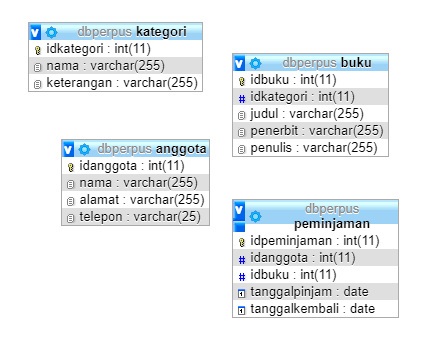
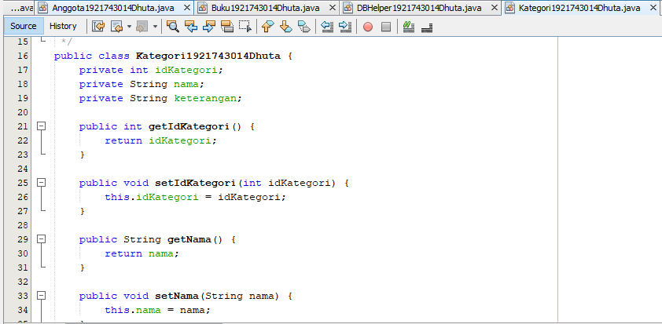
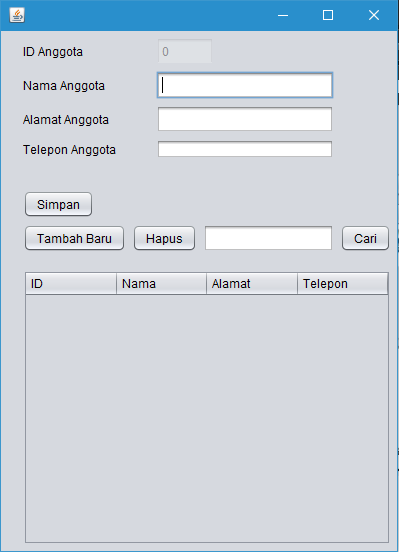

# Laporan #13 - Pengantar Konsep PBO

# ID, GUI, dan Database

## Kompetensi

	Setelah menempuh materi percobaan ini, mahasiswa mampu mengenal:  
	1. Menggunakan paradigma berorientasi objek untuk interaksi dengan database 
	2. Membuat backend dan frontend 
	3. Membuat form sebagai frontend
  

## Ringkasan Materi

### Pendahuluan

Kali ini kita akan menggunakan paradigma berorientasi objek yang telah kita pelajari untuk membuat aplikasi berbasis database dan dilengkapi dengan form sebagai Graphical User Interface (GUI).

Secara umum, tahapan yang akan kita lakukan adalah sebagai berikut: 

1. Membuat database dan tabel-tabelnya. 
2. Membuat backend yang berisi class-class yang mewakili data yang ada pada database, dan class helper untuk melakukan eksekusi query database. 
3. Membuat frontend yang merupakan antarmuka kepada pengguna. Frontend ini bisa berbasis teks (console), GUI, web, mobile, dan sebagainya.  

Library yang digunakan untuk project ini antara lain:

1. JDBC, untuk melakukan interaksi ke database. 
2. ArrayList, untuk menampung data hasil query ke database. 
3. Swing, untuk membuat tampilan GUI. 

Untuk percobaan, kita akan membuat sistem informasi Perpustakaan, yang memiliki data antara lain: Buku, Kategori, Anggota dan Peminjaman. Fitur yang ada pada aplikasi ini adalah anggota dapat melakukan peminjaman dan pengembalian buku. 

### Praktikum

### Percobaan 1 (Database) 

DB perpus

link Database sql: [ini  link ke kode program](../../src/13_ID_GUI_Database/dbperpus.sql)

### Percobaan 2

Perpustakaan

### Percobaan 3 

DBHelper

link DBHelper: [ini  link ke kode program](../../src/13_ID_GUI_Database/backend/DBHelper1921743014Dhuta.java)

### Percobaan 4

Kategori

link Kategori: [ini  link ke kode program](../../src/13_ID_GUI_Database/backend/Kategori1921743014Dhuta.form)

### Percobaan 5

TestBackend

link Test Backend: [ini  link ke kode program](../../src/13_ID_GUI_Database/frontend/TestBackend1921743014Dhuta.java)

### Percobaan 6

Class Kategori untuk GUI

link Kategori: [ini  link ke kode program](../../src/13_ID_GUI_Database/frontend/FrmKategori1921743014Dhuta.java)

Anggota

link Anggota: [ini  link ke kode program](../../src/13_ID_GUI_Database/frontend/FrmAnggota1921743014Dhuta.java)

### Percobaan 7

Form Anggota

link Form Anggota: [ini  link ke kode program](../../src/13_ID_GUI_Database/frontend/FrmAnggota1921743014Dhuta.java)

Buku

link Buku: [ini  link ke kode program](../../src/13_ID_GUI_Database/frontend/FrmBuku1921743014Dhuta.java)

### Percobaan 8

Tampilan JFrame Form Buku

### Tugas

Peminjaman

link Peminjaman: [ini  link ke kode program](../../src/13_ID_GUI_Database/frontend/FrmPeminjaman1921743014Dhuta.java)

### Lampiran

Buku

link Buku: [ini  link ke kode program](../../src/13_ID_GUI_Database/frontend/FrmBuku1921743014Dhuta.java)

### Kumpulan Lengkap src Jobsheet 13 GUI DataBase

## Kesimpulan

Kesimpulan pada jobsheet kali ini adalah kita dapat memasukkan data yang telah kita buat databasenya. Cara menghapus, edit, dan tambahkan data pada form yang telah dibuat.

## Pernyataan Diri

	Saya menyatakan isi tugas, kode program, dan laporan praktikum ini dibuat oleh saya sendiri. Saya tidak melakukan plagiasi, kecurangan, menyalin/menggandakan milik orang lain.

	Jika saya melakukan plagiasi, kecurangan, atau melanggar hak kekayaan intelektual, saya siap untuk mendapat sanksi atau hukuman sesuai peraturan perundang-undangan yang berlaku.

Ttd,

***(Dhuta Pamungkas Ibnusiqin)***
