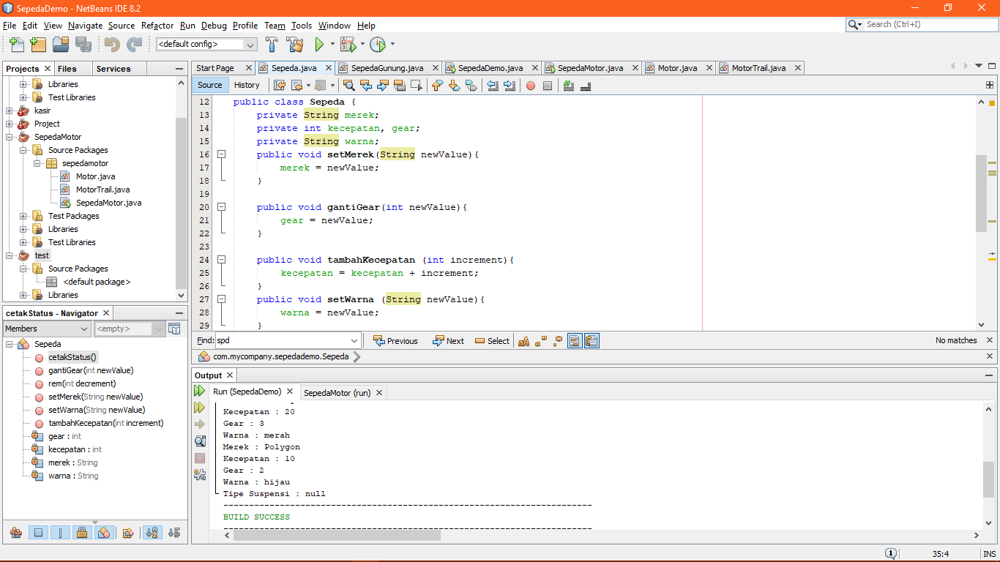
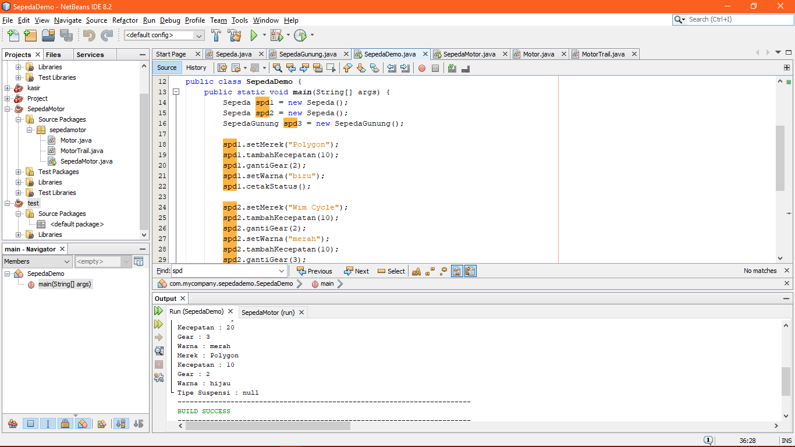
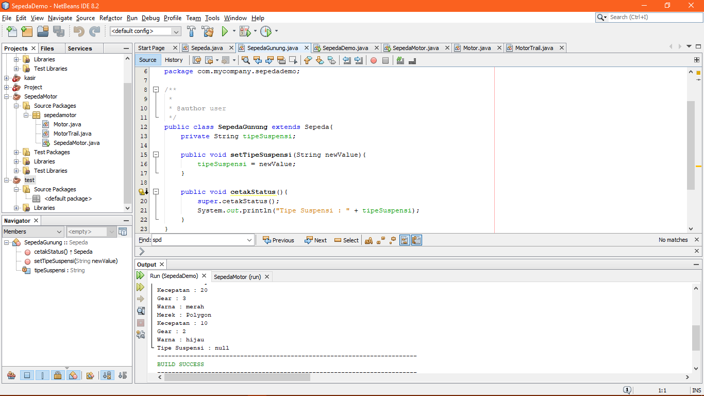
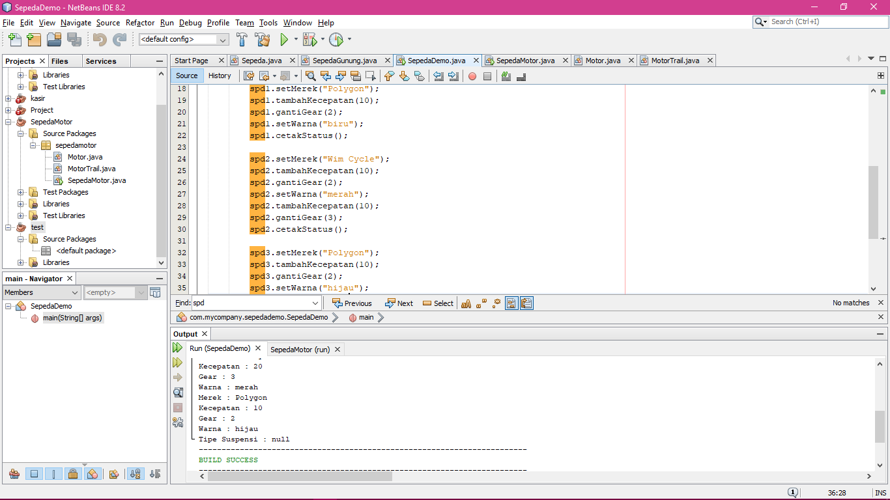
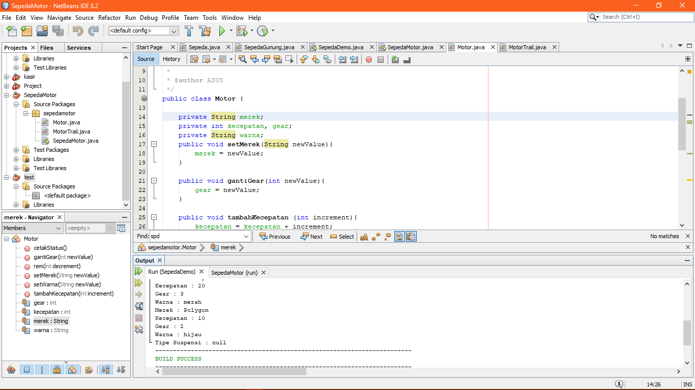
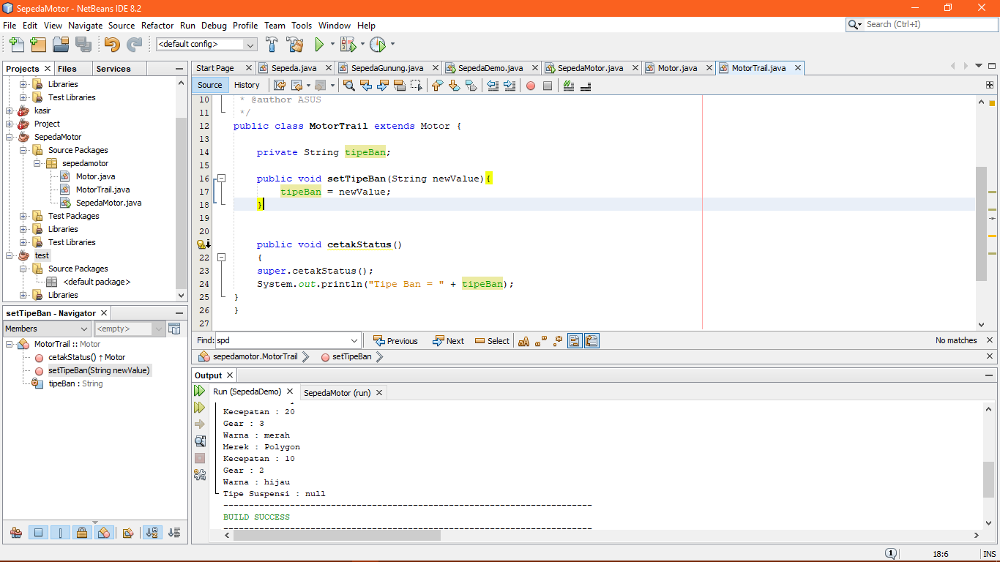
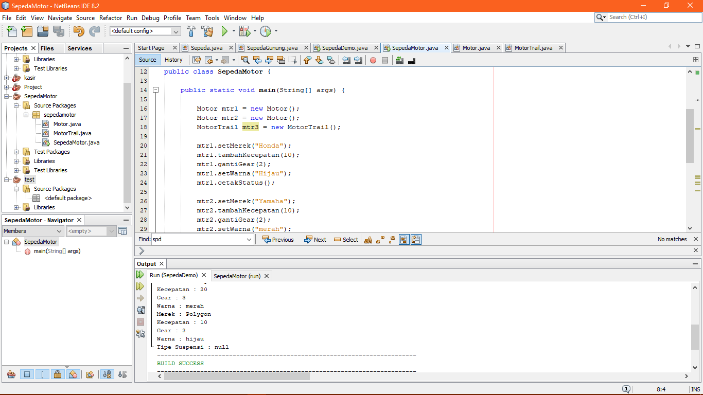

# Laporan Praktikum #1 - Pengantar Konsep PBO

## Kompetensi

(ketiklah kompetensi tiap praktikum di sini)

## Ringkasan Materi

(berisi catatan penting pribadi selama praktikum berlangsung ataupun menemukan permasalahan khusus saat melakukan percobaan)

## Percobaan

### Percobaan 1

(berisi penjelasan percobaan 1. Jika ada rujukan ke file program, bisa dibuat linknya di sini.)

`contoh screenshot yang benar, menampilkan 3 komponen, yaitu struktur project, kode program, dan hasil kompilasi`

Contoh link Sepeda : [ini contoh link ke kode program](../../src/1_Pengantar_Konsep_PBO/Sepeda.java) 
Contoh link SepedaDemo : [ini contoh link ke kode program](../../src/1_Pengantar_Konsep_PBO/SepedaDemo.java)

### Percobaan 2

(berisi penjelasan percobaan 2. Jika ada rujukan ke file program, bisa dibuat linknya di sini.)

`contoh screenshot yang benar, menampilkan 3 komponen, yaitu struktur project, kode program, dan hasil kompilasi`

Contoh link SepedaGunung : [ini contoh link ke kode program](../../src/1_Pengantar_Konsep_PBO/SepedaGunung.java)

## Pertanyaan

Jawaban 

1.   Sebutkan dan jelaskan aspek-aspek yang ada pada pemrograman berorientasi objek! 
    -Kelas kumpulan atas definisi data dan fungsi-fungsi dalam suatu unit untuk suatu tujuan tertentu. Sebagai contoh 'class of dog'          adalah suatu unit yang terdiri atas definisi-definisi data dan fungsi-fungsi yang menunjuk pada berbagai macam perilaku/turunan          dari anjing. Sebuah class adalah dasar dari modularitas dan struktur dalam pemrograman berorientasi object. 
    -Objek membungkus data dan fungsi bersama menjadi suatu unit dalam sebuah program komputer; objek merupakan dasar dari modularitas        dan struktur dalam sebuah program komputer berorientasi objek. 
    -Abstraksi Kemampuan sebuah program untuk melewati aspek informasi yang diproses olehnya, yaitu kemampuan untuk memfokus pada inti.      Setiap objek dalam sistem melayani sebagai model dari "pelaku" abstrak yang dapat melakukan kerja, laporan dan perubahan                keadaannya, dan berkomunikasi dengan objek lainnya dalam sistem, tanpa mengungkapkan bagaimana kelebihan ini diterapkan. 
    -Enkapsulasi Memastikan pengguna sebuah objek tidak dapat mengganti keadaan dalam dari sebuah objek dengan cara yang tidak layak;        hanya metode dalam objek tersebut yang diberi izin untuk mengakses keadaannya. 
    -Pholimorpisme melalui pengiriman pesan. Tidak bergantung kepada pemanggilan subrutin, bahasa orientasi objek dapat mengirim pesan;      metode tertentu yang berhubungan dengan sebuah pengiriman pesan tergantung kepada objek tertentu di mana pesa tersebut dikirim.          Contohnya, bila sebuah burung menerima pesan "gerak cepat", dia akan menggerakan sayapnya dan terbang. 
2.  Apa yang dimaksud dengan object dan apa bedanya dengan class? 
    Class adalah sebuah rancangan sedangkan objek adalah sebuah hasil dari rancangan class. 
3.  Sebutkan salah satu kelebihan utama dari pemrograman berorientasi objek dibandingkan dengan pemrograman struktural! 
    Meningkatkan produktivitas. Class dan Object pada PBO yang dibuat untuk suatu problem masih dapat dipakai lagi untuk problem lainnya     yang menggunakan objek tersebut (reusable). 
4.  Pada class Sepeda, terdapat state/atribut apa saja? 
    Merek, kecepatan, gear, dan warna. 
5.  Tambahkan atribut warna pada class Sepeda. 
    
6.  Mengapa pada saat kita membuat class SepedaGunung, kita tidak perlu membuat class nya dari nol? 
    Karena sepeda gunung adalah turunan dari class sepeda.

## Tugas

(silakan kerjakan tugas di sini beserta `screenshot` hasil kompilasi program. Jika ada rujukan ke file program, bisa dibuat linknya di sini.)

`contoh screenshot yang benar, menampilkan 3 komponen, yaitu struktur project, kode program, dan hasil kompilasi`

 
 

Contoh link Motor : [ini contoh link ke kode program](../../src/1_Pengantar_Konsep_PBO/Motor.java) 
Contoh link MotorTrail : [ini contoh link ke kode program](../../src/1_Pengantar_Konsep_PBO/MotorTrail.java) 
Contoh link SepedaMotor : [ini contoh link ke kode program](../../src/1_Pengantar_Konsep_PBO/SepedaMotor.java)

## Kesimpulan

(Berisi simpulan yang telah diperoleh selama praktikum atau belajar pada pertemuan ini)

## Pernyataan Diri

Saya menyatakan isi tugas, kode program, dan laporan praktikum ini dibuat oleh saya sendiri. Saya tidak melakukan plagiasi, kecurangan, menyalin/menggandakan milik orang lain.

Jika saya melakukan plagiasi, kecurangan, atau melanggar hak kekayaan intelektual, saya siap untuk mendapat sanksi atau hukuman sesuai peraturan perundang-undangan yang berlaku.

Ttd,

***(silakan isi nama lengkap di sini)***
