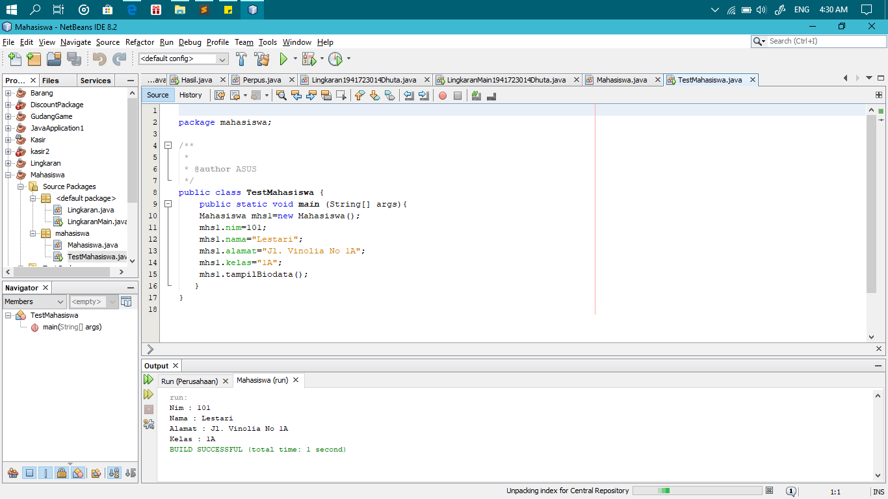
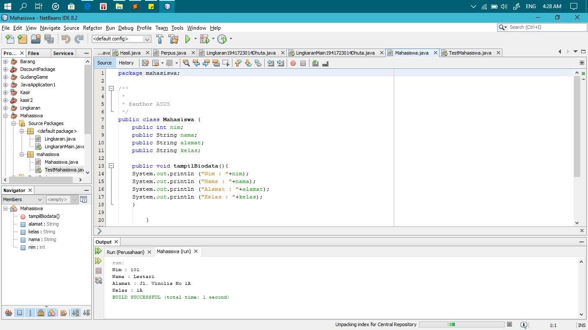
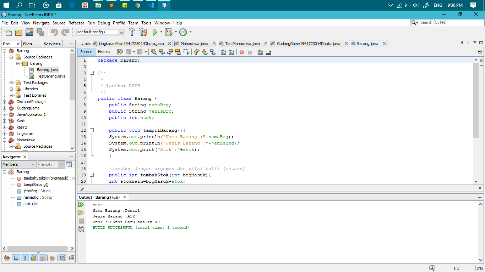
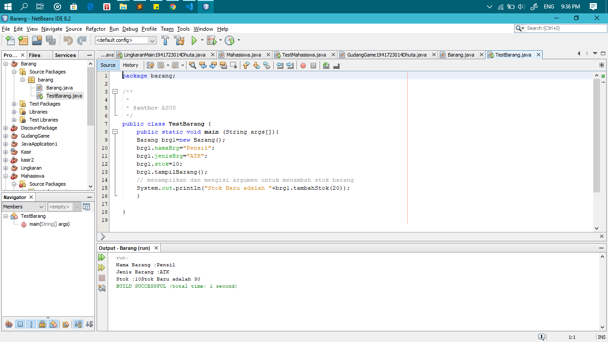
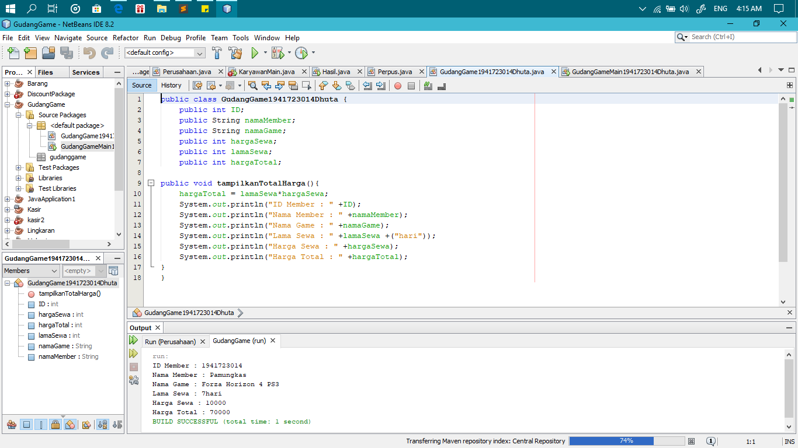
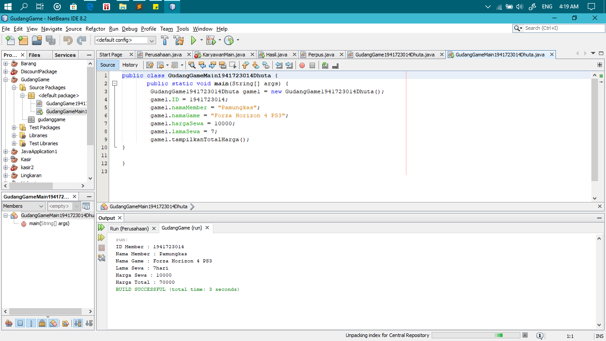
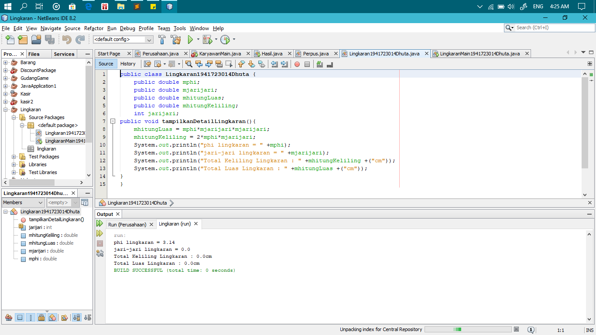
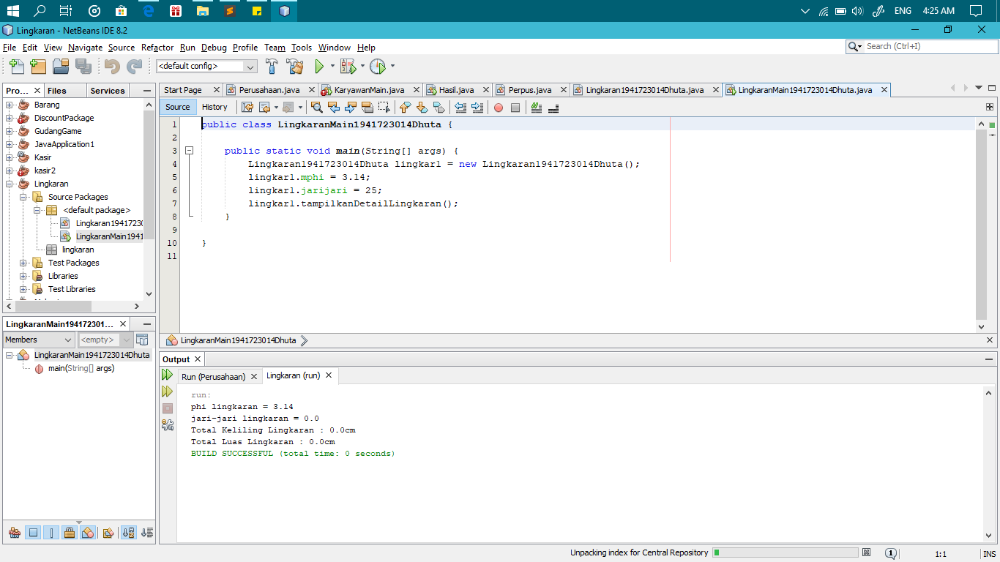

# Laporan Praktikum #2 - Pengantar Konsep PBO

## Kompetensi

Mahasiswa dapat memahami deskripsi dari class dan object   
Mahasiswa memahami implementasi dari class   
Mahasiswa dapat memahami implementasi dari attribute  
Mahasiswa dapat memahami implementasi dari method  
Mahasiswa dapat memahami implementasi dari proses instansiasi  
Mahasiswa dapat memahami implementasi dari try-catch  
Mahasiswa dapat memahami proses pemodelan class diagram menggunakan UML 

## Ringkasan Materi

Pada pertemuan sebelumnya anda sudah diberikan banyak penjelasan secara semantic (makna) mengenai deskripsi dari class dan object. Secara singkat class adalah abstraksi dari sebuah object (nyata ataupun tdk nyata) (roger s pressman). Apabila kita ingin membuat class mahasiswa, maka kita perlu melakukan abstraksi (mengindikasi bagian – bagian penting yang merepresentasikan benda itu sendiri) dari object mahasiswa itu sendiri

## Percobaan

### Percobaan 1

` screenshot yang benar, menampilkan 3 komponen, yaitu struktur project, kode program, dan hasil kompilasi`

 link TestMahasiswa.java : [ini  link ke kode program](../../src/2_Class_dan_Object/TestMahasiswa.java) 
 link Mahasiswa.java : [ini  link ke kode program](../../src/2_Class_dan_Object/Mahasiswa.java)

### Percobaan 2

` screenshot yang benar, menampilkan 3 komponen, yaitu struktur project, kode program, dan hasil kompilasi`

 link Barang.java : [ini  link ke kode program](../../src/2_Class_dan_Object/Barang.java) 
 link TestBarang.java : [ini  link ke kode program](../../src/2_Class_dan_Object/TestBarang.java)

## Tugas

` screenshot yang benar, menampilkan 3 komponen, yaitu struktur project, kode program, dan hasil kompilasi`

 
 

 link GudangGame.java : [ini  link ke kode program](../../src/2_Class_dan_Object/GudangGame1941723014Dhuta.java) 
 link GudangGameMain.java : [ini  link ke kode program](../../src/2_Class_dan_Object/GudangGameMain1941723014Dhuta.java) 

 link Lingkaran.java : [ini  link ke kode program](../../src/2_Class_dan_Object/Lingkaran.java) 
 link LingkaranMain.java : [ini  link ke kode program](../../src/2_Class_dan_Object/LingkaranMain.java)

 link Barang.java : [ini  link ke kode program](../../src/2_Class_dan_Object/Barang.java) 
 link TestBarang.java : [ini  link ke kode program](../../src/2_Class_dan_Object/TestBarang.java)

## Kesimpulan

Jadi, Class itu adalah sebuah rancangan untuk mendapatkan hasil dari main class dengan adanya extends class main class dapat lebih terperinci hasilnya

## Pernyataan Diri

Saya menyatakan isi tugas, kode program, dan laporan praktikum ini dibuat oleh saya sendiri. Saya tidak melakukan plagiasi, kecurangan, menyalin/menggandakan milik orang lain.

Jika saya melakukan plagiasi, kecurangan, atau melanggar hak kekayaan intelektual, saya siap untuk mendapat sanksi atau hukuman sesuai peraturan perundang-undangan yang berlaku.

Ttd,

***(Dhuta Pamungkas Ibnusiqin)***
