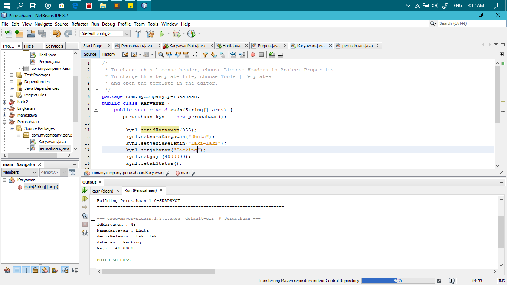

# Laporan Praktikum #2 - Pengantar Konsep PBO

## Kompetensi

Mahasiswa dapat memahami deskripsi dari class dan object   
Mahasiswa memahami implementasi dari class   
Mahasiswa dapat memahami implementasi dari attribute  
Mahasiswa dapat memahami implementasi dari method  
Mahasiswa dapat memahami implementasi dari proses instansiasi  
Mahasiswa dapat memahami implementasi dari try-catch  
Mahasiswa dapat memahami proses pemodelan class diagram menggunakan UML 

## Ringkasan Materi

Pada pertemuan sebelumnya anda sudah diberikan banyak penjelasan secara semantic (makna) mengenai deskripsi dari class dan object. Secara singkat class adalah abstraksi dari sebuah object (nyata ataupun tdk nyata) (roger s pressman). Apabila kita ingin membuat class mahasiswa, maka kita perlu melakukan abstraksi (mengindikasi bagian – bagian penting yang merepresentasikan benda itu sendiri) dari object mahasiswa itu sendiri

## Percobaan

### Percobaan 1

Perusahaan

Karyawan.java

Atribut yang dapat diidentifikasi dari class diagram diatas yaitu :
-	id_Kar : int, PK
-	nama_Kar : String (30)
-	jns_kel : Enum('L','P')
-	jabatan : String(10)
-	gaji : Float(12) 

Method yang dihasilkan dari data diatas yaitu :
-	setData()
-	setGaji().

link Perusahaan.java : [ini  link ke kode program](../../src/2_Class_dan_Object/Perusahaan.java) 
link Karyawan.java : [ini  link ke kode program](../../src/2_Class_dan_Object/Karyawan.java)

### Percobaan 2

TestMahasiswa.java

Mahasiswa

- Pada percobaan ini kita akan membuat Project Baru yang bernama Mahasiswa.
- Gambar diatas ialah hasil dari project Mahasiswa.
- Pada project ini akan ditampilkan data NIM, Nama, Alamat, Kelas.

 link TestMahasiswa.java : [ini  link ke kode program](../../src/2_Class_dan_Object/TestMahasiswa.java) 
 link Mahasiswa.java : [ini  link ke kode program](../../src/2_Class_dan_Object/Mahasiswa.java)

### Percobaan 3

Barang

BarangMain

- Pada percobaan ini kita akan membuat project Barang
- Dimana pada project ini kita akan menampilkan Nama Barang, Jenis Barang, Stok dan Stok setelah diubah

 link Barang.java : [ini  link ke kode program](../../src/2_Class_dan_Object/Barang.java) 
 link TestBarang.java : [ini  link ke kode program](../../src/2_Class_dan_Object/TestBarang.java)

## Tugas

Gudang Game

 

Gudang Game Main

 

1. Pada Kasus ini diminta membuat Class Diagram dengan nama Gudang Game.
2. pada class tersebut memiliki atribut.
	- IdGame : int
	- NamaMember : String(30)
	- NamaGame : String(15)
	- LamaSewa : int
	- HargaSewa : int
	- HargaTotal : int
3. Terdapat 2 method yaitu
	- TampillPinjam();
	- TotalPinjam();
     

link GudangGame.java : [ini  link ke kode program](../../src/2_Class_dan_Object/GudangGame1941723014Dhuta.java) 
 link GudangGameMain.java : [ini  link ke kode program](../../src/2_Class_dan_Object/GudangGameMain1941723014Dhuta.java) 

Lingkaran

Lingkaran Main

- Pada soal ini kita akan membuat program Lingkaran
- Dimana terdapat atribut mPhi, mJJ, mHitungLuas, mHitungKll.
- Terdapat method sHitungLuas(), sHitungKll, sTampilDetailLingkaran. 

 link Lingkaran.java : [ini  link ke kode program](../../src/2_Class_dan_Object/Lingkaran.java) 
 link LingkaranMain.java : [ini  link ke kode program](../../src/2_Class_dan_Object/LingkaranMain.java)

Barang

Barang Main

- Argumen yang diberikan ke parameter harus cocok baik dalam urutan, jumlah maupun tipe data sebagaimana yang telah ditentukan di method signature.
- Metode return dimana metode ini metode yang mengembalikan suatu nilai. Untuk penulisan metodenya yakni pertama tentukan dulu tipeDatanya lalu di ikuti dengan nama fungsinya.

 link Barang.java : [ini  link ke kode program](../../src/2_Class_dan_Object/Barang.java) 
 link TestBarang.java : [ini  link ke kode program](../../src/2_Class_dan_Object/TestBarang.java)

## Kesimpulan

Jadi, Class itu adalah sebuah rancangan untuk mendapatkan hasil dari main class dengan adanya extends class main class dapat lebih terperinci hasilnya

## Pernyataan Diri

Saya menyatakan isi tugas, kode program, dan laporan praktikum ini dibuat oleh saya sendiri. Saya tidak melakukan plagiasi, kecurangan, menyalin/menggandakan milik orang lain.

Jika saya melakukan plagiasi, kecurangan, atau melanggar hak kekayaan intelektual, saya siap untuk mendapat sanksi atau hukuman sesuai peraturan perundang-undangan yang berlaku.

Ttd,

***(Dhuta Pamungkas Ibnusiqin)***
