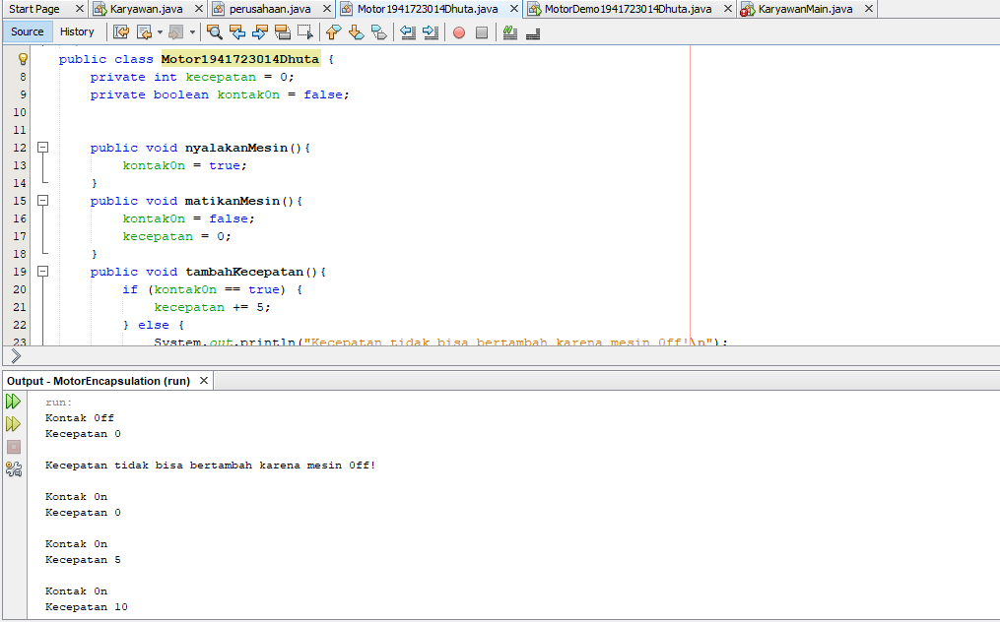

# Laporan Praktikum 3 - Pengantar Konsep PBO

## Kompetensi

Setelah melakukan percobaan pada modul ini, mahasiswa memahami konsep:

1. Konstruktor
2. Akses Modifier
3. Atribut/method pada class
4. Intansiasi atribut/method 
5. Setter dan getter
6. Memahami notasi pada UML Class Diagram

## Ringkasan Materi

1. Enkapsulasi 
Enkapsukasi disebut juga dengan information-hiding. Dalam berinteraksi dengan objek, seringkali kita tidak perlu mengetahui kompleksitas yang ada didalamnya. Hal ini akan lebih mudah dipahami jika kita membayangkan atau menganalisa objek yang ada disekitar kita, misalnya objek sepeda, ketika kita mengganti gear pada sepeda, kita tinggal menekan tuas gear yang ada di grip setang sepeda saja.
2. Konstruktor 
Konstruktor mirip dengan method cara deklarasinya akan tetapi tidak memiliki tipe return. Dan konstruktor dieksekusi ketika instan dari objek dibuat. Jadi setiap kali sebuat objek dibuat dengan keyword new() maka konstruktor akan dieksekusi.
3. Akses Modifier 
Terdapat 2 tipe modifier di java yaitu : akses modifier dan non-access modifier. Dalam hal ini kita akan fokus pada akses modifier yang berguna untuk mengatur akses method, class, dan constructor.
4. Getter dan Setter 
Getter adalah public method dan memiliki tipe data return, yang berfungsi untuk mendapatkan nilai dari atribut private. Sedangkan setter adalah public method yang tidak memliki tipe data return, yang berfungsi untuk memanipulasi nilai dari atribut private.
5.  Notasi UML Class Diagram  

Keterangan : 
1. Class  
2. Interface  
3. Enumeration – adalah tipe data yang memiliki nilai atau literal yang terbatas.  
4. Atrributes  
5. Method  
6. Literals  
Notasi akses modifier pada UML class diagram adalah sebagai berikut:  
1. Tanda plus (+) untuk public  
2. Tanda pagar (#)  untuk protected  
3. Tanda  minus (-) untuk private  
4. Untuk default, maka tidak diberi notasi  

## Percobaan

### Percobaan 1

Encapsulation

`Motor 150` 
`Motor Sport` 
 link kode program: [Program Motor150](../../src/3_Enkapsulasi/Motor150.java) 
 link kode program: [Program Motor Demo](../../src/3_Enkapsulasi/MotorDemo.java) 

### Percobaan 2

Access Modifier

`Motor` 
`Motor Demo` 
 link kode program: [Motor](../../src/3_Enkapsulasi/MotorEncapsulation.java) 
 link kode program: [Motor Demo](../../src/3_Enkapsulasi/MotorDemo.java)

### Percobaan 3

Getter dan Setter

`Anggota` 
`Koperasi Demo` 
 link kode program: [Anggota](../../src/3_Enkapsulasi/Anggota.java) 
 link kode program: [Koperasi Demo](../../src/3_Enkapsulasi/KoperasiDemo.java)

 ### Percobaan 4

 Konstruktor, Instansiasi

 `Koperasi Demo` 
 `Anggota` 
 link kode program: [Koperasi Demo](../../src/3_Enkapsulasi/koperasiDemo.java) 
 link kode program: [Anggota](../../src/3_Enkapsulasi/Anggota.java)

 ## Pertanyaan
 
1. Apa yang dimaksud getter dan setter?
* Jawab : Getter dan Setter ialah method modifier public jika setter tidak memiliki nilai kembalian disini getter yang mempunyai kambalian nilai Gampangnya Setter untuk menSet sebuah nilaiVoid kalu getter untuk menarik nilaiVoid.
2. Apa kegunaan dari method getSimpanan()?
* Jawab kegunaanya untuk mengambil nilai dari void class utama .Contoh Class Laptop ingin menampilkan outputnya maka klass VarianLaptop harus menarik dulu menggunakan method tampilVarian();
3. Method apa yang digunakan untk menambah saldo?
* Jawab : method setor
4. Apa yand dimaksud konstruktor?
* Jawab : Konstruktor adalah tahapan perancangan dimana ada method ada class ada system tetap belum sampai tahap output rincinya.
5. Sebutkan aturan dalam membuat konstruktor?
* Jawab : Aturan dalam membuat konstruktor ialah system yang sistematik dimana harus ada relasi dan keterkaitan antar class dan method yang di gunakan.
6. Apakah boleh konstruktor bertipe private?
* Jawab : Boleh Karena dalam konstruksi variable class tergantung kebutuhan user saat ingin menggunakan tipe private,public dll, intinya sesuai kebutuhanya.
7. Kapan menggunakan parameter dengan passsing parameter?
* Jawab : Parameter di gunakan untuk menentukan atau menghitung hasil dari suatu variabel dengangkan passing parameter di gunakan untuk mengirim fungsi dari sebuah method namun passing parameter tidak akan mempengaruhi dari niali awal parameter
8. Apa perbedaan atribut class dan instansiasi atribut?
* Jawab : Atribut Class adalah rincian dari method contoh Class laptop atributnya keyboard,lcd,MotherBoard sedangkan kalau instansiasi atribut di gunakan untuk mengeluarkan output dari atribut class, supaya kita tidak mengetik ulang atribut yang sudah ada.
9. Apa perbedaan class method dan instansiasi method?
* Jawab : Method adalah cara atau methode sedangkan instansiasi method adalah penggabungan dua cara atau dua methode

## Tugas

 `Encap Demo` 
 `Encap Test` 
 link kode program: [Encap Demo](../../src/3_Enkapsulasi/EncapDemo.java) 
 link kode program: [Encap Test](../../src/3_Enkapsulasi/EncapTest.java)

## Jawaban
2. Karena dalam class Encap Demo tidak di tampilkan system output dan di class Encap Demo di tampilkan maka yang tampil adalah nilai yang ada di dalam class
3. Perbedaanya dengan nomor dua di sini dalam {tinggi=30;jumlah=tinggi+tinggi;} dan pada tinggi saya batasi dengan tinggi=18;

`Koperasi` 
 `Test Koperasi` 
 link kode program: [Koperasi](../../src/3_Enkapsulasi/Koperasi.java) 
 link kode program: [Test Koperasi](../../src/3_Enkapsulasi/TestKoperasi.java) 
 `Koperasi Console` 

 Program Pinjaman Dan Angsuran Agus salim pinjam uang 10 juta dengan limit pinjaman 5 juta = pinjam 4 juta lalu mengangsur 1 juta lalu angsur lagi 3 juta = 4Juta-1Juta = 3Juta | 3Juta-3Juta=0 Jadi sekarang Agus Tidak punya Hutang

## Kesimpulan

* Kesimpulanya di modul 3 kita belajar mengenai konsep serta relasi antar class dengan cara Enkapsulasi, Konstruktor, dan Modifield dimana semua saling berkaitan dalam tujuan pengembangan suatu program object.

## Pernyataan Diri

Saya menyatakan isi tugas, kode program, dan laporan praktikum ini dibuat oleh saya sendiri. Saya tidak melakukan plagiasi, kecurangan, menyalin/menggandakan milik orang lain.

Jika saya melakukan plagiasi, kecurangan, atau melanggar hak kekayaan intelektual, saya siap untuk mendapat sanksi atau hukuman sesuai peraturan perundang-undangan yang berlaku.

Ttd,

***(Dhuta Pamungkas Ibnusiqin)***
