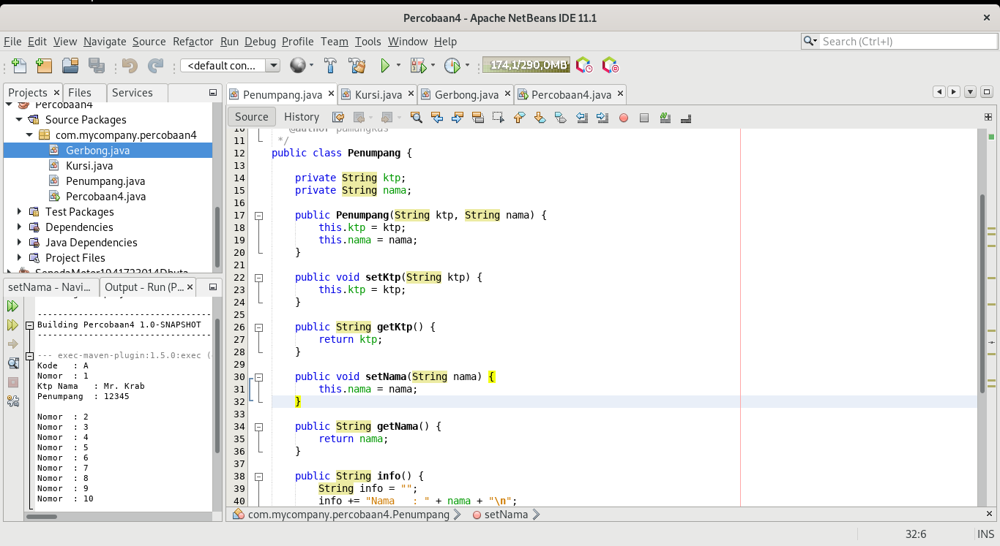
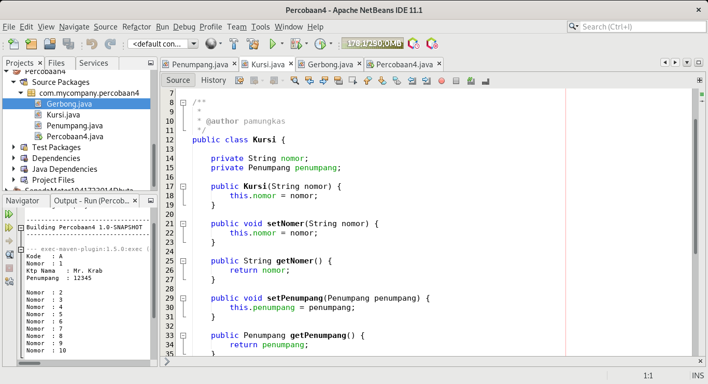
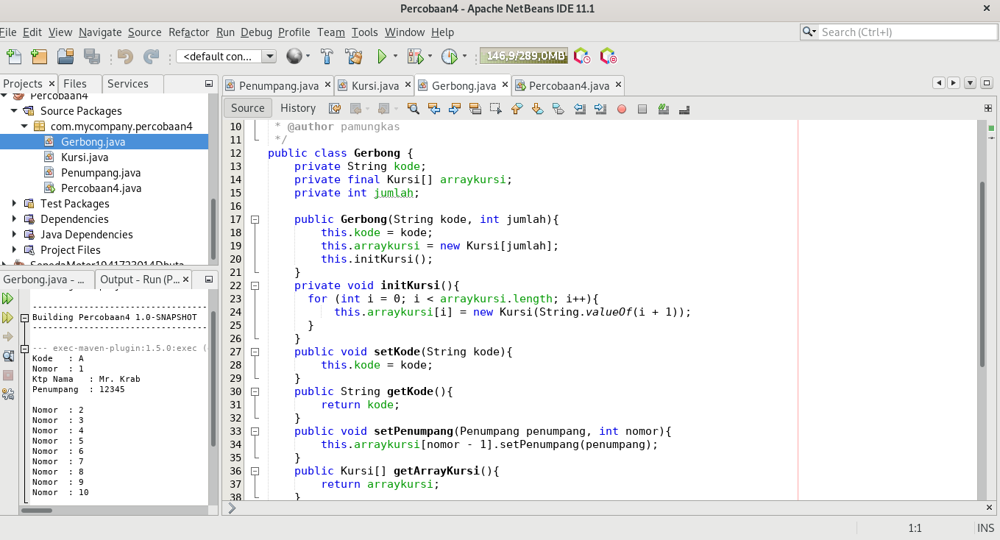

# Laporan Praktikum #2 - Pengantar Konsep PBO

## Kompetensi

	Setelah menempuh pokok bahasan ini, mahasiswa mampu:
	1. Memahami konsep relasi kelas; 
	2. Mengimplementasikan relasi has‑a dalam program.  

## Ringkasan Materi

## Percobaan

### Percobaan 1

Laptop

Processor

## Pertanyaan

	1.	Di dalam class Processor dan class Laptop , terdapat method setter dan getter untuk masing‑masing atributnya. Apakah gunanya method setter dan getter tersebut ? 
	Jawab :
	Method setter dan getter adalah dua method yang tugasnya untuk mengambil dan mengisi data ke dalam objek.

	2.	Di dalam class Processor dan class Laptop, masing‑masing terdapat konstruktor default dan konstruktor berparameter. Bagaimanakah beda penggunaan dari kedua jenis konstruktor tersebut
	Jawab :
	Constructor adalah method khusus yang akan dieksekusi pada saat pembuatan objek (instance).
	Constructor parameter Constructor biasanya digunakan untuk initialize (menyiapkan) data untuk class.

	3.	Perhatikan class Laptop, di antara 2 atribut yang dimiliki (merk dan proc), atribut manakah yang bertipe object ?
	Jawab :
	Processor

	4.	Perhatikan class Laptop, pada baris manakah yang menunjukan bahwa class Laptop memiliki relasi dengan class Processor ?
	Jawab:
	private Processor proc

	5.	Perhatikan pada class Laptop , Apakah guna dari sintaks proc.info() ? 
	jawab :
	Menampilkan hasil dari merk laptop

	6.	Pada class MainPercobaan1, terdapat baris kode: Laptop l = new Laptop("Thinkpad", p);. Apakah p tersebut ? Dan apakah yang terjadi jika baris kode tersebut diubah menjadi: Laptop l = new Laptop("Thinkpad", new Processor("Intel i5", 3)); Bagaimanakah hasil program saat dijalankan, apakah ada perubahan ? 
	Jawab :
	P adalah nama alias

link Laptop.java : [ini  link ke kode program](../../src/4_Relasi_Class/Laptop.java) 
link Processor.java : [ini  link ke kode program](../../src/4_Relasi_Class/Processor.java)

### Percobaan 2

Sopir

Pelanggan

Mobil

## Pertanyaan

	1.	Perhatikan class Pelanggan. Pada baris program manakah yang menunjukan bahwa class Pelanggan memiliki relasi dengan class Mobil dan class Sopir ? 
	Jawab :
	private Mobil mobil;
 	private Sopir sopir;

	2.	Perhatikan method hitungBiayaSopir pada class Sopir, serta method hitungBiayaMobil pada class Mobil. Mengapa menurut Anda method tersebut harus memiliki argument hari ? 
	Jawab :
	Untuk menghitung total biaya

	3.	Perhatikan kode dari class Pelanggan. Untuk apakah perintah mobil.hitungBiayaMobil(hari) dan sopir.hitungBiayaSopir(hari) ? 
	Jawab :
	Untuk menghituing keseluruhan dari total biaya sopir dan dan mobil

	4.	Perhatikan class MainPercobaan2. Untuk apakah sintaks p.setMobil(m) dan p.setSopir(s) ? 
	Jawab :
	Untuk memanggil method Mobil dan Sopir

	5.	Perhatikan class MainPercobaan2. Untuk apakah proses p.hitungBiayaTotal() tersebut ?
	Jawab :
	Untuk memanggil method BiayaTotal

	6.	Perhatikan class MainPercobaan2, coba tambahkan pada baris terakhir dari method main dan amati perubahan saat di‑run! System.out.println(p.getMobil().getMerk()); Jadi untuk apakah sintaks p.getMobil().getMerk() yang ada di dalam method main tersebut? 
	Jawab :
	Untuk menambahkan method hasil dari Mobil dan Merk

 link Sopir : [ini  link ke kode program](../../src/4_Relasi_Class/Sopir.java) 
 link Pelanggan : [ini  link ke kode program](../../src/4_Relasi_Class/Pelanggan.java) 
 link Mobil : [ini  link ke kode program](../../src/4_Relasi_Class/Mobil.java)

### Percobaan 3

Pegawai

Kereta Api

## Pertanyaan

	1.	Di dalam method info() pada class KeretaApi, baris this.masinis.info() dan this.asisten.info() digunakan untuk apa ?
	Jawab :
	Untuk menmpilkan method masinis dan asisten

	2.	Buatlah main program baru dengan nama class MainPertanyaan pada package yang sama. Tambahkan kode berikut pada method main() !
	Jawab :

	3.	Apa hasil output dari main program tersebut ? Mengapa hal tersebut dapat terjadi ? 
	Jawab :
	Menampikan output dari method keretaApi dan nama pegawai

	4.	Perbaiki class KeretaApi sehingga program dapat berjalan ! 
	Jawab :

 link Pegawai : [ini  link ke kode program](../../src/4_Relasi_Class/pegawai.java) 
 link Kereta Api : [ini  link ke kode program](../../src/2_Class_dan_Object/keretaApi.java)

### Percobaan 4

Penumpang

Kursi

Gerbong

## Pertanyaan

	1.	Pada main program dalam class MainPercobaan4, berapakah jumlah kursi dalam Gerbong A ?
	Jawab :
	Total dari gerbong A adalah 10

	2.	Perhatikan potongan kode pada method info() dalam class Kursi. Apa maksud kode tersebut ? 
	... if (this.penumpang != null) { info += "Penumpang: " + penumpang.info() + "\n"; } ...
	Jawab :
	Menampilkan variable dari objek

	3.	Mengapa pada method setPenumpang() dalam class Gerbong, nilai nomor dikurangi dengan angka 1 ?
	Jawab :
	Penyeleksian dari nomor 10 sampai dengan i, i = -1

	4.	

	

	5.	

 link Penumpang : [ini  link ke kode program](../../src/4_Relasi_Class/penumpang.java) 
 link Kursi : [ini  link ke kode program](../../src/4_Relasi_Class/kursi.java) 
 link Gerbong : [ini  link ke kode program](../../src/4_Relasi_Class/Gerbong.java)

## Tugas

Relasi Restouran

Pembeli

Pelayan

Makanan

Kasir

## Kesimpulan

Jadi, Dalam suatu sistem akan ditemukan lebih dari satu class yang saling memiliki keterkaitan antara class satu dengan yang lain. 

## Pernyataan Diri

Saya menyatakan isi tugas, kode program, dan laporan praktikum ini dibuat oleh saya sendiri. Saya tidak melakukan plagiasi, kecurangan, menyalin/menggandakan milik orang lain.

Jika saya melakukan plagiasi, kecurangan, atau melanggar hak kekayaan intelektual, saya siap untuk mendapat sanksi atau hukuman sesuai peraturan perundang-undangan yang berlaku.

Ttd,

***(Dhuta Pamungkas Ibnusiqin)***
