# Laporan #6 - Pengantar Konsep PBO

# Inheritance

## Kompetensi

	1. Memahami konsep dasar inheritance atau pewarisan.	
 	2. Mampu membuat suatu subclass dari suatu superclass tertentu.
 	3. Mampu mengimplementasikan konsep	single dan multilevel inheritance.	
 	4. Mampu membuat objek dari suatu subclass dan melakukan pengaksesan terhadap atribut dan method baik yang dimiliki sendiri atau turunan dari superclass nya.
  

## Ringkasan Materi

Inheritance atau perwakilan sifat merupakan suatu cara untuk menurunkan suatu class yang lebih umum menjadi suatu class yang lebih spesifik. Inheritance adalah salah satu ciri utama suatu bahasa program yang berorientasi objek.

1.	Single Inheritance<br>
Single Inheritance adalah suatu class yang hanya mempunyai suatu class parent.
2.	Multilevel Inheritance<br>
Multilevel Inheritance adalah suatu subclass bisa menjadi superclass bagi class yang lain.


## Percobaan

### Percobaan 1 (extends)

ClassA

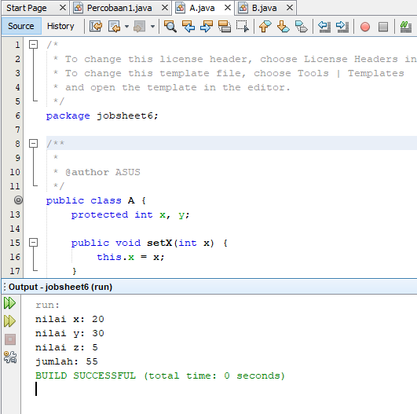

ClassB

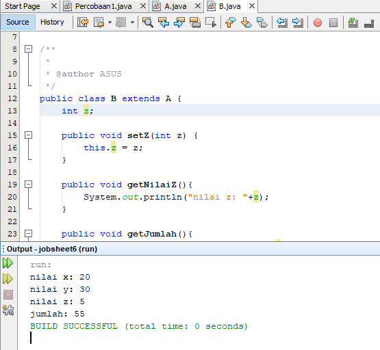

Percobaan1

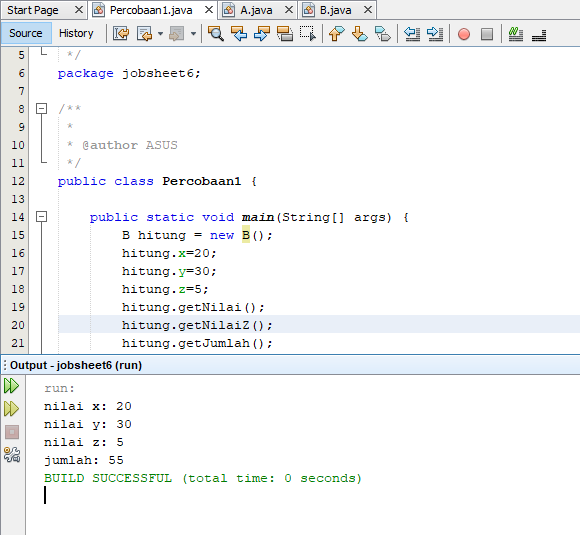

## Pertanyaan

	1.	Pada percobaan 1 diatas program yang dijalankan terjadi error, kemudian perbaiki sehingga program tersebut bisa dijalankan dan tidak error! 
	Jawab :


	2.	Jelaskan apa penyebab program pada percobaan 1 ketika dijalankan terdapat error!
	Jawab :
	Error tersebut dikarenakan tidak menggunakan extends ClassA

link ClassA : [ini  link ke kode program](../../src/4_Relasi_Class/Laptop.java)<br>
link ClassB : [ini  link ke kode program](../../src/4_Relasi_Class/Processor.java)<br>
link Percobaan 1 : [ini  link ke kode program](../../src/4_Relasi_Class/Processor.java)

### Percobaan 2

ClassA


ClassB


Percobaa 2


## Pertanyaan

	1.	Pada percobaan 2 diatas program yang dijalankan terjadi error, kemudian perbaiki sehingga program tersebut bisa dijalankan dan tidak error!
	Jawab :

	2.	Jelaskan apa penyebab program pada percobaan 1 ketika dijalankan terdapat error! 
	Jawab :
	
 link ClassA : [ini  link ke kode program](../../src/4_Relasi_Class/Sopir.java)<br>
 link ClassB : [ini  link ke kode program](../../src/4_Relasi_Class/Pelanggan.java)<br>
 link Percobaan 2 : [ini  link ke kode program](../../src/4_Relasi_Class/Mobil.java)

### Percobaan 3

Bangun

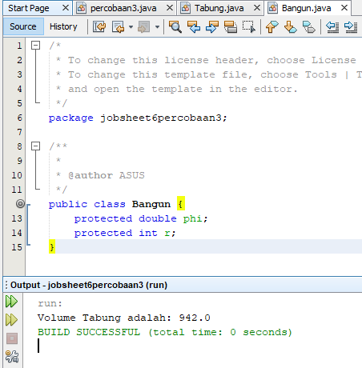

Tabung

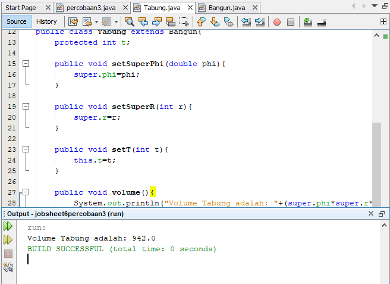

Percobaan 3

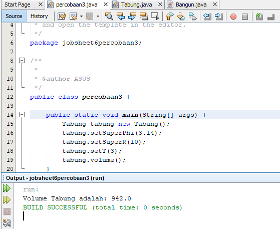

## Pertanyaan

	1.	Jelaskan fungsi "super" pada potongan program berikut di class Tabung!

	```java
		 public void setSuperPhi(double phi){
     		super.phi = phi;
		}

		 public void setSuperR(int r){
     	 	super.r = r;
 		}
	```

	Jawab :
	Super diatas digunakan untuk memanggil atribut pada class parent yaitu class Bangun, yang mana atributnya akan memanggil phi dan r

	2.	Jelaskan fungsi "super" dan "this" pada potongan program berikut di class Tabung


	```java
		public void volume(){
    		System.out.println("Volume Tabung : " + (super.phi * super.r * super.r * this.t));
		}
	```

	Jawab :
	Pada perhitungan diatas, super digunakan untuk memanggil atribut phi dan r dari class Bangun atau class parent sedangkan this digunakan untuk memanggil atribut t dari class itu sendiri

	3.	Jelaskan mengapa pada class Tabung tidak dideklarasikan atribut "phi" dan "r" tetapi class tersebut dapat mengakses atribut tersebut!
	Jawab :
	Karena class Tabung merupakan turunan/subclass dari class Bangun sehingga dapat menggunakan atribut dari parent class dengan menggunakan super tanpa harus mendeklarasikan ulang atribut phi dan r


 link Bangun : [ini  link ke kode program](../../src/4_Relasi_Class/pegawai.java)<br>
 link Tabung : [ini  link ke kode program](../../src/2_Class_dan_Object/keretaApi.java)<br>
 link Percobaan 3 : [ini  link ke kode program](../../src/2_Class_dan_Object/keretaApi.java)

### Percobaan 4

ClassA


ClassB


ClassC


Percobaan4


## Pertanyaan

	1.	Pada percobaan 4 sebutkan mana class yang termasuk superclass dan subclass, kemudian jelaskan alasanya!
	Jawab :
	-	ClassA merupakan superclass pada ClassB, dan ClassB merupakan subclass dari ClassA. Karena pada ClassB terdapat extends ClassA yang merupakan deklarasi inheritance
	-	ClassB merupakan superclass pada ClassC, dan ClassC merupakan subclass dari ClassB. Karena pada ClassC terdapat extends ClassB yang merupakan deklarasi inheritance

	2.	Ubahlah isi konstruktor default ClasC seperti berikut:


	```java
		public class ClassC entends ClassB{
        ClassC(){
            super();
            System.out.println("Konstruktor C dijalankan");
        }
    }
	```
	Tambahkan kata super() dibaris Pertama dalam konstruktor defaultnya. Coba jalankan kembali class Percobaan 4 dan terlihat tidak ada perbedaan dari hasil outputnya!
	Jawab :
	Tidak ada perubahan


	3.	Ubahlah defaultnya ClassC seperti berikut:

	```java
	public class ClassC entends ClassB{
        ClassC(){
            System.out.println("Konstruktor C dijalankan");
            super();
        }
    }
	```

	Ketika mengubah posisi super() dibaris kedua dalam konstruktor defaultnya dan terlihat ada error. Kemudian kembalikan super() kebaris pertama seperti sebelumnya, maka errornya akan hilang.
	Perhatikan keluaran ketika class percobaan 4 dijalankan. Kenapa bisa tampil output seperti berikut pada saat instansiasi objek test dari class ClassC.
	Jelaskan bagaimana urutan proses jalannya konstruktor saat objek test dibuat!
	Jawab :
	Karena pada saat program dijalankan, konstruktor classC memanggil konstruktor parent dengan kode super() sehingga isi konstruktor classB dapat dipanggil

	4.	Apakah fungi super() pada potongan program dibawah ini di ClassC!

	```java
	public class ClassC entends ClassB{
        ClassC(){
            super();
            System.out.println("Konstruktor C dijalankan");
        }
    }
	```

	Jawab:
	Untuk memanggil kontruktor parent atau superclass

link ClassA : [ini  link ke kode program](../../src/4_Relasi_Class/penumpang.java)

link ClassB : [ini  link ke kode program](../../src/4_Relasi_Class/kursi.java)

link ClassC : [ini  link ke kode program](../../src/4_Relasi_Class/Gerbong.java)

link Percobaan4 : [ini  link ke kode program](../../src/4_Relasi_Class/Gerbong.java)

## Percobaan 5

Karyawan

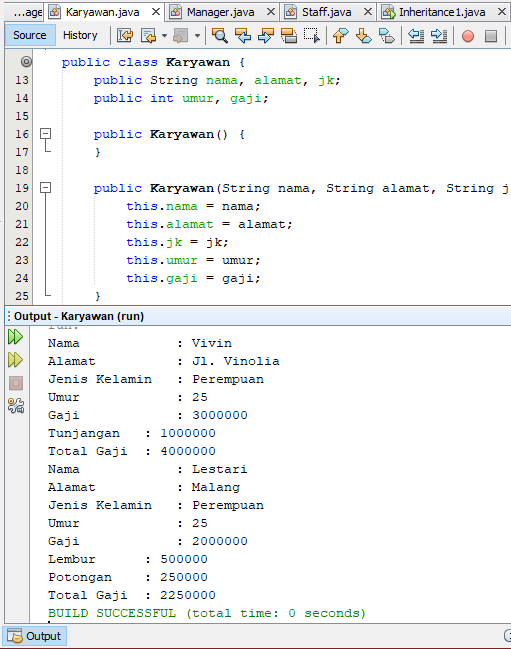

Manager

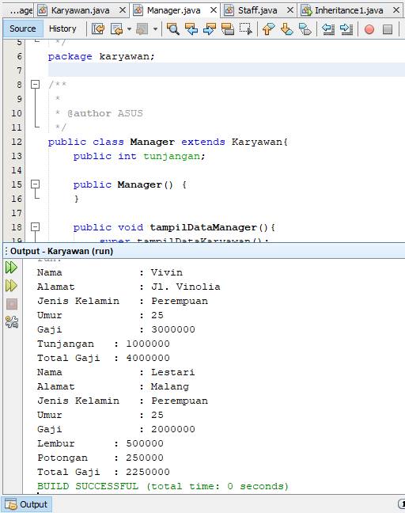

Staff

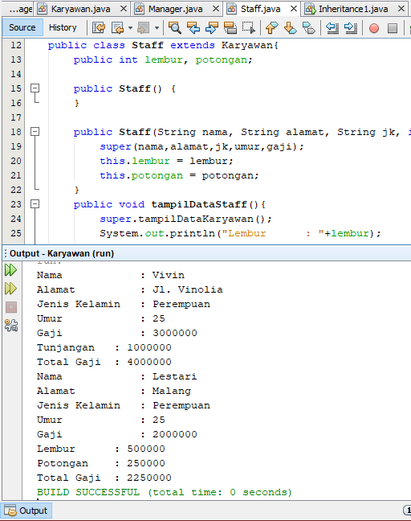

Inheritance1

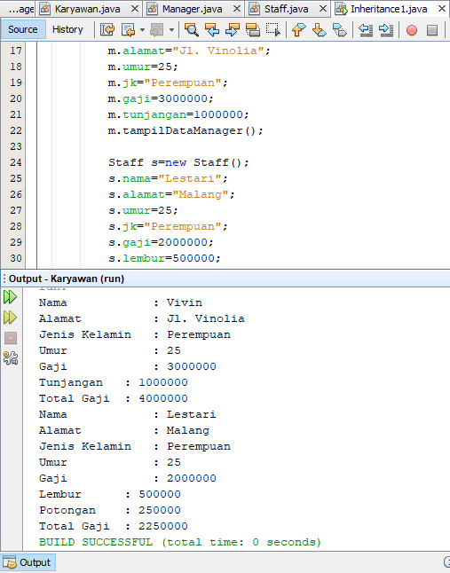


## Pertanyaan

	1.	Sebutkan class mana yang termasuk superclass dan sub class dari percobaan 1 diatas!
	Jawab:
	-	SuperClass dari percobaan 5 diatas yaitu class Karyawan
	-	SubClass dari percobaan 5 diatas yaitu class Manager dan class Staff

	2.	Kata kunci apakah yang digunakan untuk menurunkan suatu class ke class yang lain?
	Jawab:
	Untuk mewariskan suatu class cukup ditambahkan extends (class parent) setelah nama class

	3.	perhatikan code program pada class Manager, atribut apa saja yang dimiliki oleh class tersebut? Sebutkan atribut mana saja yang diwarisi dari class karyawan!
	Jawab:
	-	Atribut yang dimiliki oleh class Manager adalah tunjangan
	-	Atribut yang diwariskan oleh class Karyawan yaitu atribut nama, alamat, jk, umur, gaji

	4.	Jelaskan kata kunci super pada potongan program dibawah ini yang terdapat pada class Manager!

	```java
	System.out.println("Total Gaji      : " + (super.mGaji + mTunjangan));
	```

	Jawab:
	Super digunakan untuk memanggil data pada class parent, seperti contoh diatas. Super untuk memanggil atribut gaji yang berada pada parent class yaitu class karyawan

	5.	Program pada percobaan 1 diatas termasuk dalam jenis inheritance apa? Jelaskan alasannya!
	Jawab:
	Program diatas termasuk jenis single inheritance karena hanya diturunkan sekali, dan subclassnya tidak memiliki turunan lagi

link Karyawan : [ini  link ke kode program](../../src/4_Relasi_Class/penumpang.java)

link Manager : [ini  link ke kode program](../../src/4_Relasi_Class/kursi.java)

link Staff : [ini  link ke kode program](../../src/4_Relasi_Class/Gerbong.java)

link Inheritance : [ini  link ke kode program](../../src/4_Relasi_Class/Gerbong.java)

## Percobaan 6

StafTetap

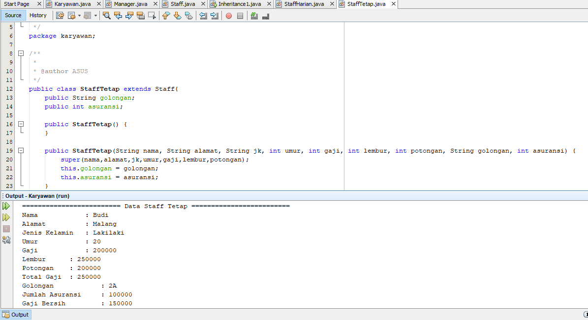

StaffHarian

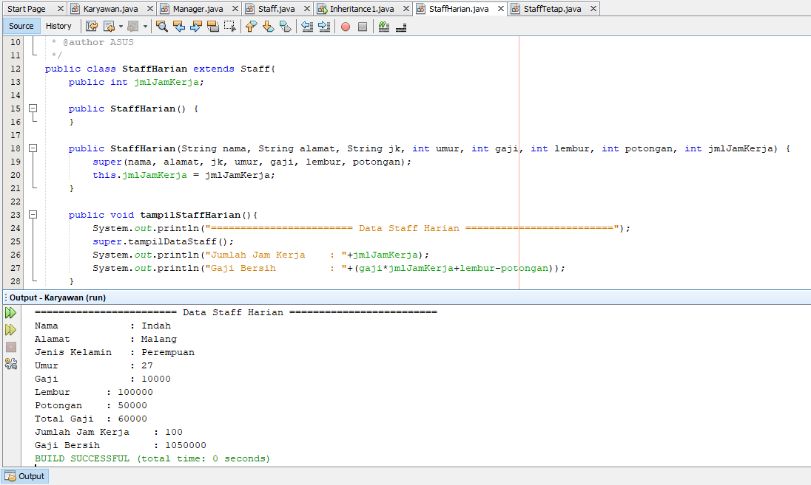

Inheritance1

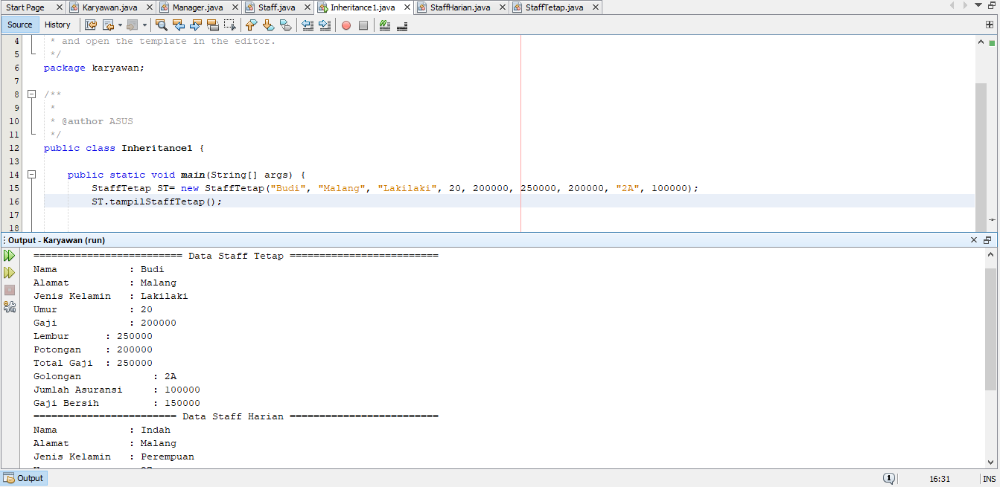

## Pertanyaan

	1.	Berdasarkan class diatas manakah yang termasuk single inheritance dan mana yang termasuk multilevel inheritance?
	Jawab :
	Pada percobaan diatas, yang termasuk single inheitance yaitu class Manager karena tidak memiliki subclass lagi. Sedangkan yang termasuk multilevel inheritance ialah class staff karena pada class staff memiliki turunan lagi yaitu class StaffHarian dan class staffTetap

	2.	Perhatikan kode program class StaffTetap dan StaffHarian, atribut apa saja yang dimiliki oleh class tersebut?
	Jawab :
	-	Atribut yang dimiliki oleh class StaffHarian yaitu jmlJamKerja
	-	Atribut yang dimiliki oleh class StaffTetap yaitu golongan dan asuransi
	-	Atribut yang diwariskan oleh class Staff yaitu lembur dan potongan

	3.	Apakah fungsi potongan program berikut pada class StaffHarian

	```java
	super(nama, alamat, jk, umur, gaji, lembur, potongan);
	```

	Jawab:
	Potongan program diatas berfungsi untuk memanggil atribut pada class super pada saat konstruktor dibuat

	4.	Apakah fungsi potongan program berikut pada class StaffHarian

	```java
	super.tampilDataStaff();
	```

	Jawab:
	Potongan program diatas berfungsi untuk memanggil method tampilDataStaff() yang berada pada super class

	5.	Perhatikan kode dibawah ini yang terdapat pada class StaffTetap
	Terlihat dipotongan 	

	```java
	System.out.println("Gaji bersih     : " + (mGaji*mLembur-mPotongan-mAsuransi));
	```
	Terlihat dipotongan program diatas atribut gaji, lembur dan potongan dapat diakses langsung. Kenapa hal ini bisa terjadi dan bagaimana class StaffTetap memiliki atribut gaji,lembur,dan potongan padaha dalam class tersebut tidak dideklarasikan atribut gaji,lembur, dan potongan?
	Jawab:
	Karena atribut tersebut sudah terpanggil pada Konstruktor sehingga atribut pada class super dapat dipakai

link StaffHarian : [ini  link ke kode program](../../src/4_Relasi_Class/Gerbong.java)

link StaffHarian : [ini  link ke kode program](../../src/4_Relasi_Class/Gerbong.java)

link Inheritance1 : [ini  link ke kode program](../../src/4_Relasi_Class/Gerbong.java)

## Tugas 10

Komputer

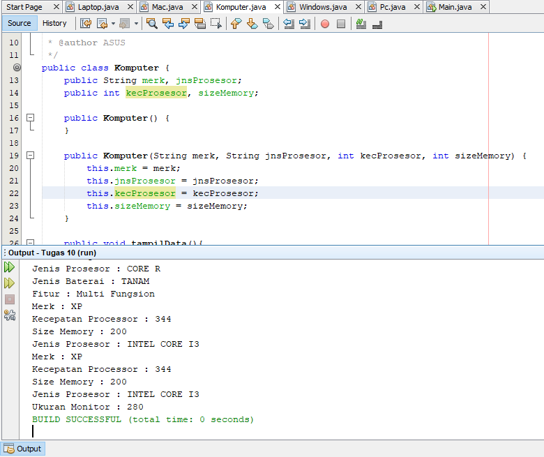

Laptop

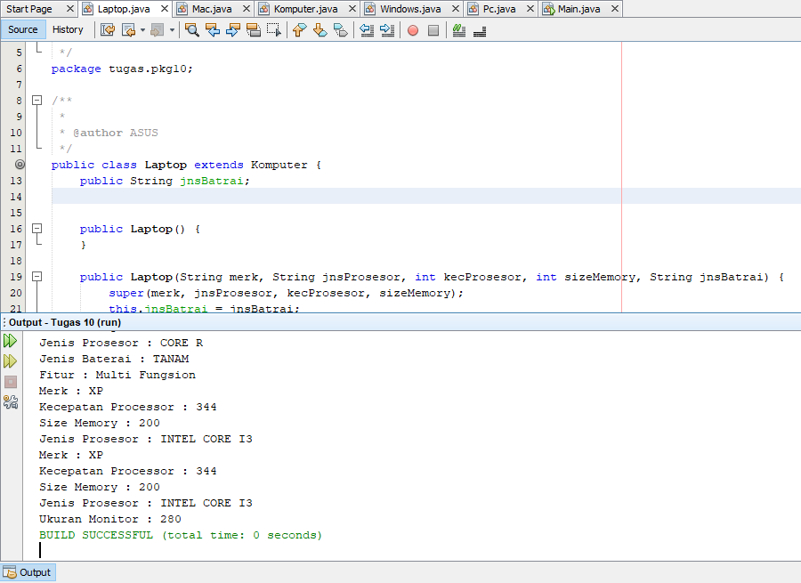

Mac

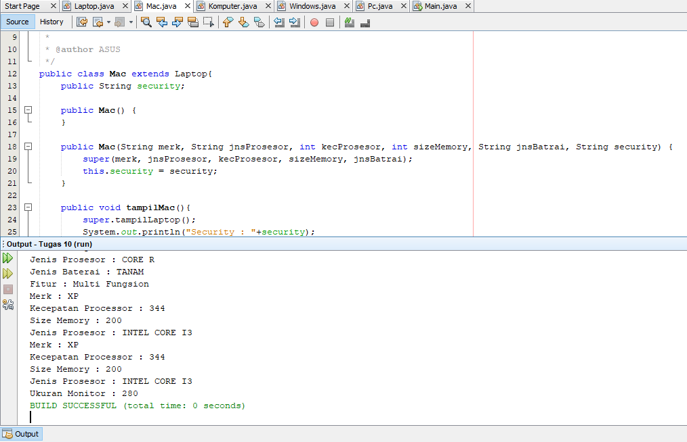

Windows

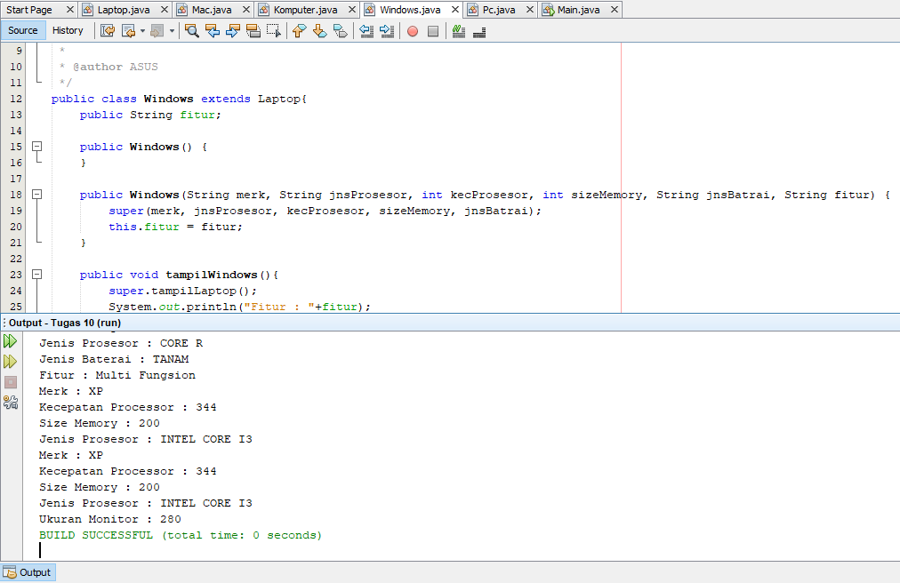

Pc

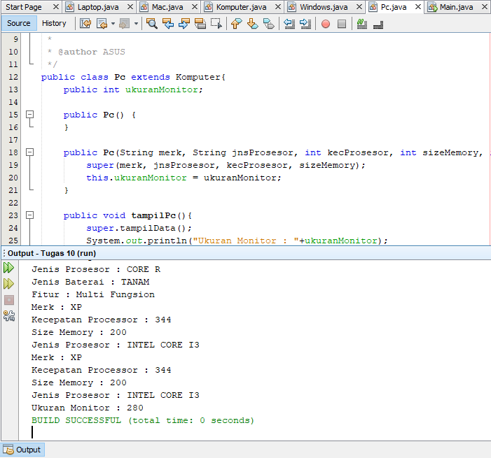

link Komputer : [ini  link ke kode program](../../src/4_Relasi_Class/Gerbong.java)<br>

link Laptop : [ini  link ke kode program](../../src/4_Relasi_Class/Gerbong.java)<br>

link Mac : [ini  link ke kode program](../../src/4_Relasi_Class/Gerbong.java)<br>

link Windows : [ini  link ke kode program](../../src/4_Relasi_Class/Gerbong.java)<br>

link Pc : [ini  link ke kode program](../../src/4_Relasi_Class/Gerbong.java)


## Kesimpulan

	Jadi, Inheritance adalah bentuk sebuah penurunan atau pewarisan. Contoh seorang kakek memiliki anak dan anak tersebut memiliki cucu. Pada sebuah program kita dapat menggunakan atribut class pada subclass tanpa harus mengetik ulang lagi atribut tersebut.

## Pernyataan Diri

	Saya menyatakan isi tugas, kode program, dan laporan praktikum ini dibuat oleh saya sendiri. Saya tidak melakukan plagiasi, kecurangan, menyalin/menggandakan milik orang lain.

	Jika saya melakukan plagiasi, kecurangan, atau melanggar hak kekayaan intelektual, saya siap untuk mendapat sanksi atau hukuman sesuai peraturan perundang-undangan yang berlaku.

Ttd,

***(Dhuta Pamungkas Ibnusiqin)***
