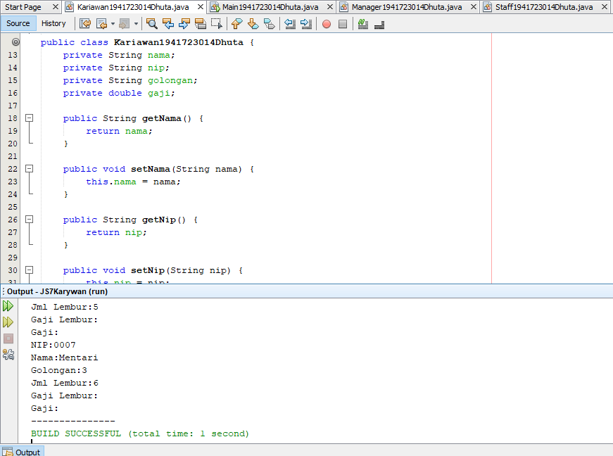
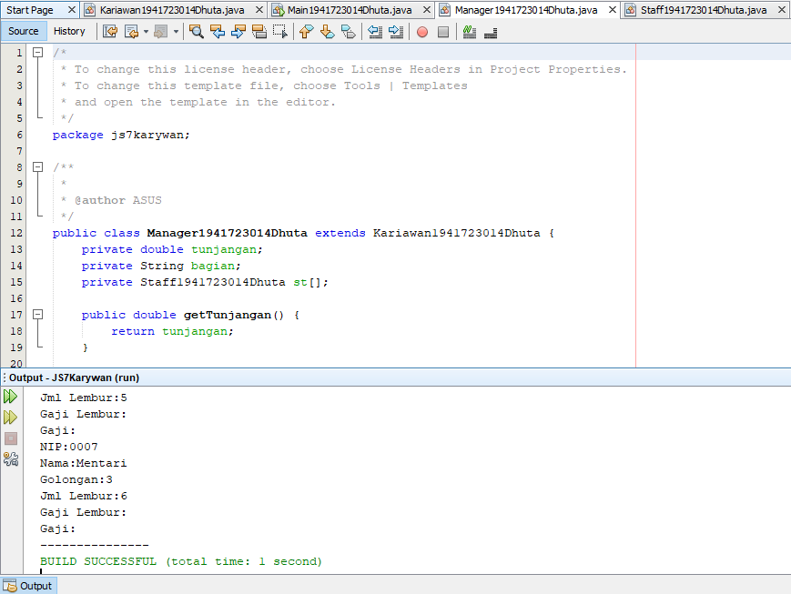
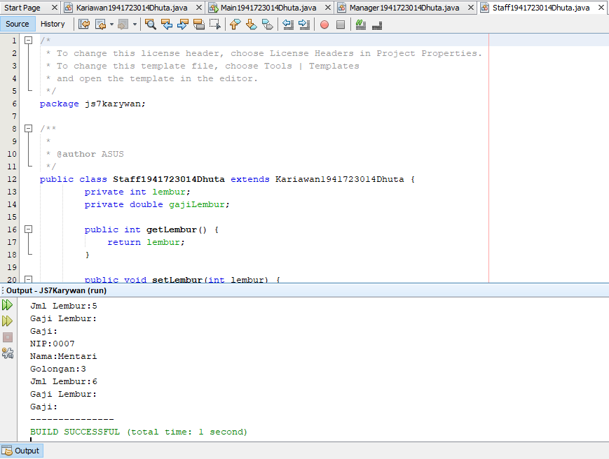
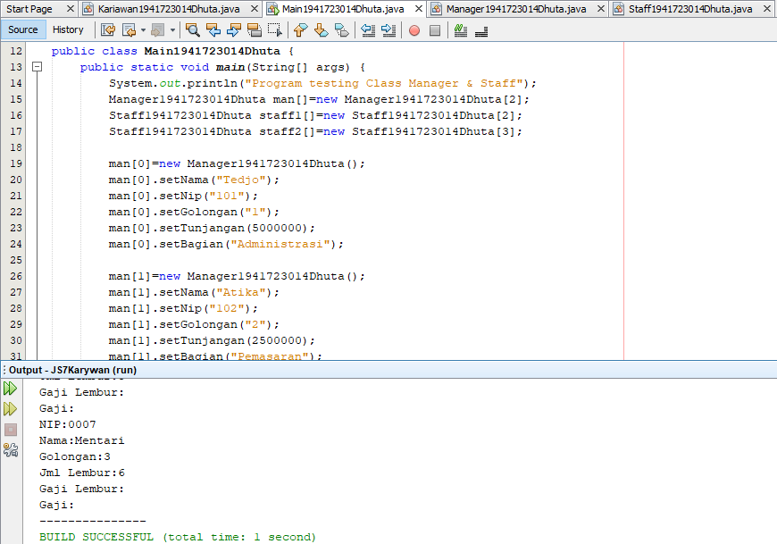
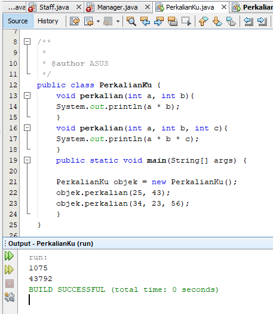
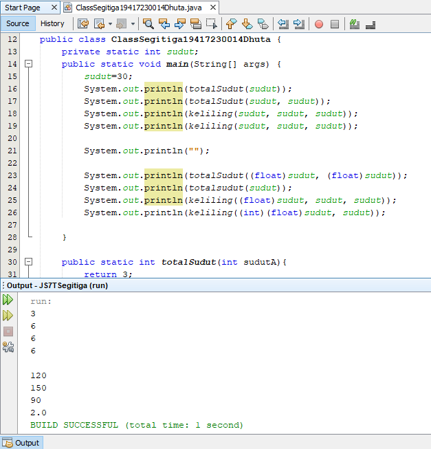
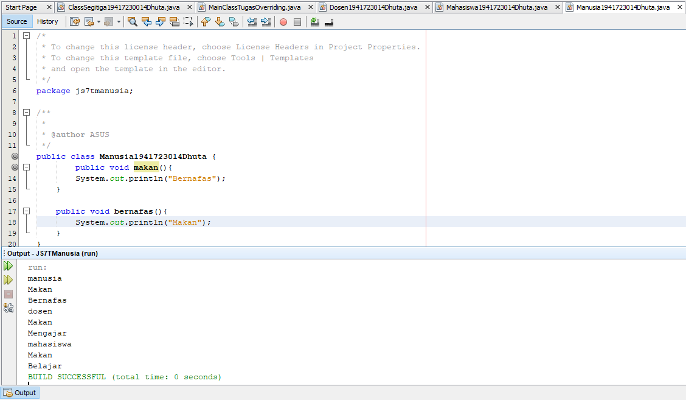
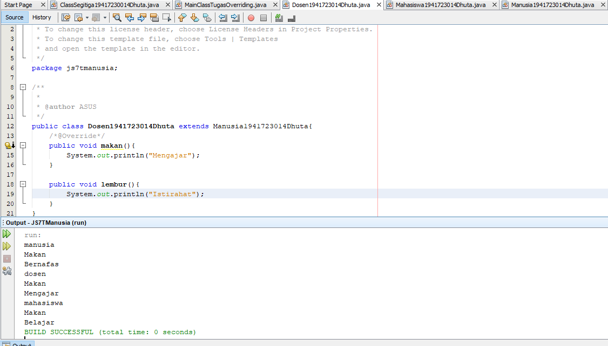
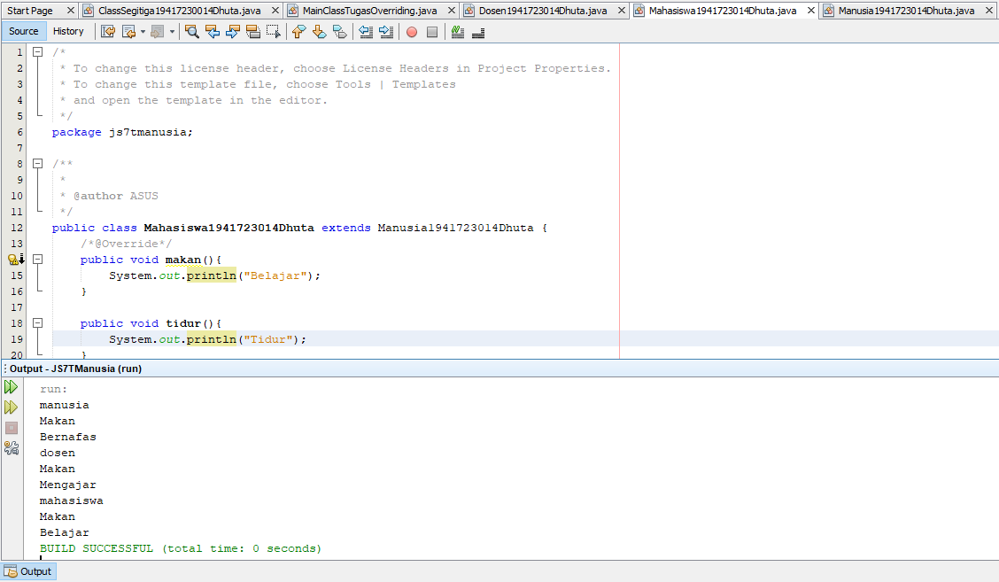

# Laporan #7 - Pengantar Konsep PBO

# Overloading & Overriding

## Kompetensi

	Setelah menempuh pokok bahasan ini, mahasiswa mampu : 
	a. Memahami konsep overloading dan overriding. 
	b. Memahami perbedaan overloading dan overriding. c. Ketepatan dalam mengidentifikasi method overriding dan overloading.
	d. Ketepatan dalam mempraktekkan instruksi pada jobsheet. 
	e. Mengimplementasikan method overloading dan overriding.
  

## Ringkasan Materi

### Overloading
Adalah menuliskan kembali method dengan nama yang sama pada suatu class. Tujuannya dapat memudahkan penggunaan/pemanggilan method dengan fungsionalitas yang mirip. Overloading juga bisa terjadi antara parent class dengan subclass-nya jika memenuhi ketiga syarat overload.

### Overriding
Adalah Sublass yang berusaha memodifkasi tingkah laku yang diwarisi dari superclass. Tujuannya subclass dapat memiliki tingkah laku yang lebih spesifik sehingga dapat dilakukan dengan cara mendeklarasikan kembali method milik parent class di subclass. Sehingga method pada parent class disebut overridden method dan method pada subclass disebut overriding method. 

## Percobaan

### Percobaan 1

Karyawan  

Manager

Staff

Main

link Karyawan : [ini  link ke kode program](../../src/7_Overloading_Overriding/Kariawan1941723014Dhuta.java) 
link Manager : [ini  link ke kode program](../../src/7_Overloading_Overriding/Manager1941723014Dhuta.java) 
link Staff : [ini  link ke kode program](../../src/7_Overloading_Overriding/Staff1941723014Dhuta.java) 
link Main : [ini  link ke kode program](../../src/7_Overloading_Overriding/MainClassTugasOverriding.java)

### Percobaan 2 (Latihan)

### PerkalianKu

PerkalianKu1

## Pertanyaan

	1. Dari source coding diatas terletak dimanakah overloading?
	Jawab:
	Berada di void perkalian (int a, int b) parameter

	2. Jika terdapat overloading ada berapa jumlah parameter yang berbeda? 
	Jawab:
	Ada 2

link PerkalianKu 1 : [ini  link ke kode program](../../src/7_Overloading_Overriding/PerkalianKu.java)

PerkalianKu2

## Pertanyaan

	1.  Dari source coding diatas terletak dimanakah overloading? 
	Jawab:
	Berada di (int a, int b) dan (double a, double b)

	2. Jika terdapat overloading ada berapa tipe parameter yang berbeda? 
	Jawab:
	Ada dua int dan double
	
link PerkalianKu 2: [ini  link ke kode program](../../src/7_Overloading_Overriding/PerkalianKu2.java)

### Ikan

Ikan

## Pertanyaan

	1.  Dari source coding diatas terletak dimanakah overriding? 
	Jawab:
	

	2. Jabarkanlah apabila sourcoding diatas jika terdapat overriding?
	Jawab:
	Overriding Merupakan Suatu Keadaan Dimana kelas fish dan piranha dapat mengubah atau bisa kita bilang memodifikasi atau memperluas data dan method pada kelas ikan
 
link Ikan: [ini  link ke kode program](../../src/7_Overloading_Overriding/Ikan.java)

## Tugas

### Overloading (Segitiga)

Segitiga

link Segitiga: [ini  link ke kode program](../../src/7_Overloading_Overriding/ClassSegitiga19417230014Dhuta.java)

### Overriding (Manusia)

Manusia

Dosen

Mahasiswa

link Manusia: [ini  link ke kode program](../../src/7_Overloading_Overriding/Manusia1941723014Dhuta.java) 
link Dosen: [ini  link ke kode program](../../src/7_Overloading_Overriding/Dosen1941723014Dhuta.java) 
link Mahasiswa: [ini  link ke kode program](../../src/7_Overloading_Overriding/Mahasiswa1941723014Dhuta.java)

## Kesimpulan

	Jadi, Overloadning adalah  menuliskan kembali method dengan nama yang sama pada suatu class. Tujuannya dapat memudahkan penggunaan/pemanggilan method dengan fungsionalitas yang mirip. Sedangkan Overriding adalah Sublass yang berusaha memodifkasi tingkah laku yang diwarisi dari superclass. Tujuannya subclass dapat memiliki tingkah laku yang lebih spesifik sehingga dapat dilakukan dengan cara mendeklarasikan kembali method milik parent class di subclass.

## Pernyataan Diri

	Saya menyatakan isi tugas, kode program, dan laporan praktikum ini dibuat oleh saya sendiri. Saya tidak melakukan plagiasi, kecurangan, menyalin/menggandakan milik orang lain.

	Jika saya melakukan plagiasi, kecurangan, atau melanggar hak kekayaan intelektual, saya siap untuk mendapat sanksi atau hukuman sesuai peraturan perundang-undangan yang berlaku.

Ttd,

***(Dhuta Pamungkas Ibnusiqin)***