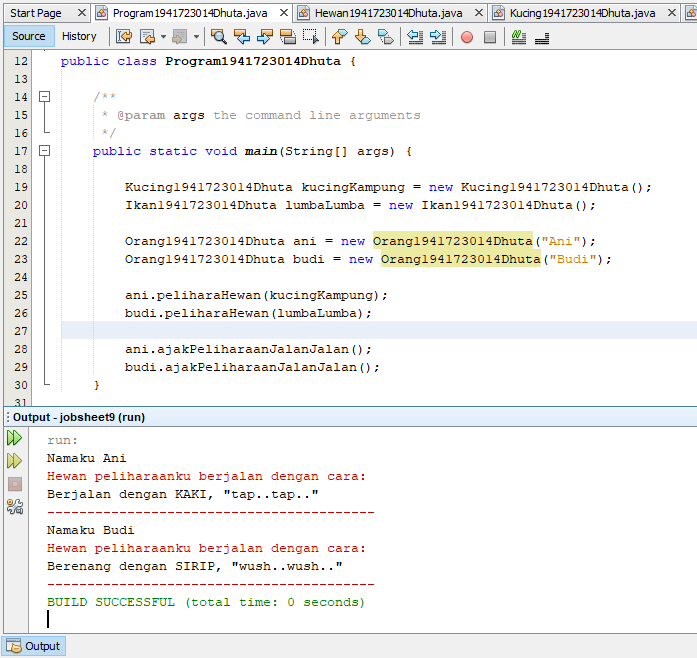
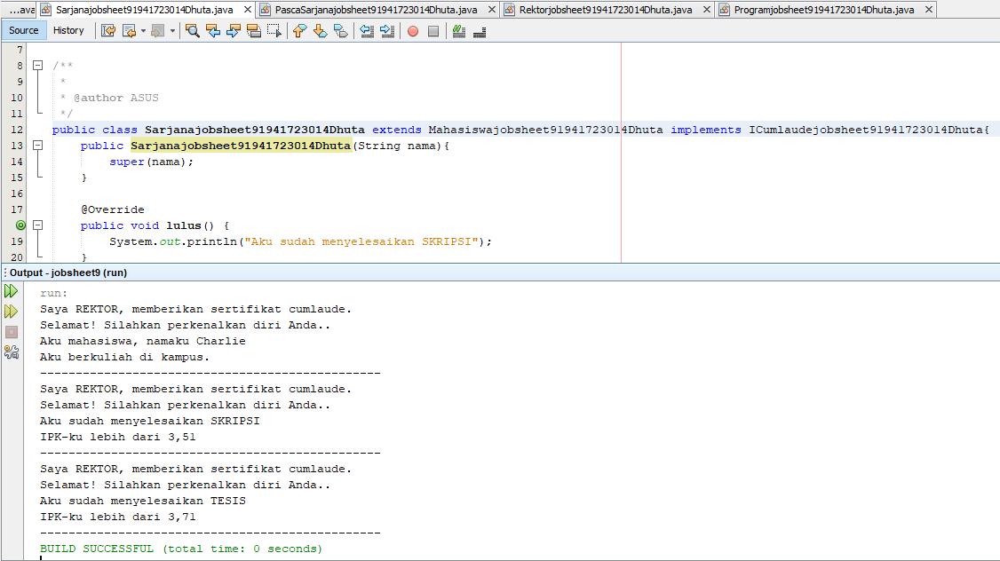
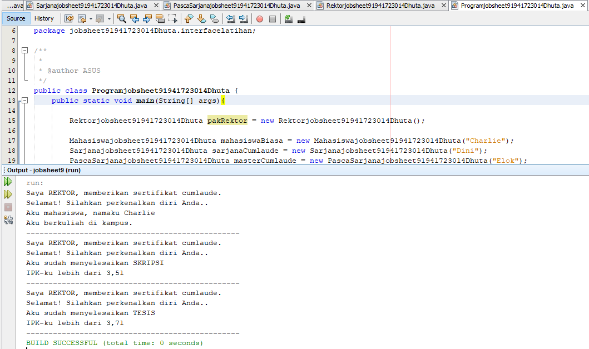

# Laporan #9 - Pengantar Konsep PBO

# Abstract Class & Interface

## Kompetensi

	Setelah menyelesaikan lembar kerja ini mahasiswa diarapkan mampu: 
	1. Menjelaskan maksud dan tujuan penggunaan Abstract Class.
	2. Menjelaskan maksud dan tujuan penggunaan Interface.
	3. Menggunakan Abstract Class dan Interface di dalam pembuatan program.
  

## Ringkasan Materi

### Abstract Class
Abstract Class adalah Class yang tidak dapat diinstansiasi namun dapat di-extend. Abstract class baru dapat dimanfaatkan ketia ia di-extend.

### Interface
Interface adalah Struktur data yang hanya berisi abstract methods. Tidak ada apaapa selain method abstract pada interface, termasuk atribute getter dan setter.

## Percobaan

### Percobaan 1 (Abstract Class)

Hewan

Kucing

Ikan

Orang

Program

## Pertanyaan

	Bolehkah apabila sebuah class yang meng-extend suatu abstract class tidak mengimplementasikan method abstract yang ada di class induknya? Buktikan!”
	Jawab:

link Hewan : [ini  link ke kode program](../../src/9_Abstract_Class_Interface/Hewan1941723014Dhuta.java) 
link Kucing : [ini  link ke kode program](../../src/9_Abstract_Class_Interface/Kucing1941723014Dhuta.java) 
link Ikan : [ini  link ke kode program](../../src/9_Abstract_Class_Interface/Ikan1941723014Dhuta.java) 
link Orang : [ini  link ke kode program](../../src/9_Abstract_Class_Interface/Orang1941723014Dhuta.java) 
link Program : [ini  link ke kode program](../../src/9_Abstract_Class_Interface/Program1941723014Dhuta.java)

### Percobaan 2 (Interface)

ICumlaude

Mahasiswa

Sarjana

Pasca Sarjana

Rektor

Program

## Pertanyaan

	1.  Mengapa pada langkah nomor 9 terjadi error? Jelaskan!
	Jawab:

	2. 	Dapatkah method kuliahDiKampus() dipanggil dari objek sarjanaCumlaude di class Program? Mengapa demikian?
	Jawab:

	3.	Dapatkah method kuliahDiKampus() dipanggil dari parameter mahasiswa di method beriSertifikatCumlaude() pada class Rektor? Mengapa demikian?
	Jawab:

	4.	Modifikasilah method beriSertifikatCumlaude() pada class Rektor agar hasil eksekusi class Program menjadi seperti berikut:
	Jawab:
	
link ICumlaude: [ini  link ke kode program](../../src/9_Abstract_Class_Interface/ICumlaudejobsheet91941723014Dhuta.java) 
link Mahasiswa: [ini  link ke kode program](../../src/9_Abstract_Class_Interface/Mahasiswajobsheet91941723014Dhuta.java) 
link Sarjana: [ini  link ke kode program](../../src/9_Abstract_Class_Interface/Sarjanajobsheet91941723014Dhuta.java) 
link Pasca Sarjana: [ini  link ke kode program](../../src/9_Abstract_Class_Interface/PascaSarjanajobsheet91941723014Dhuta.java) 
link Rektor: [ini  link ke kode program](../../src/9_Abstract_Class_Interface/Rektorjobsheet91941723014Dhuta.java) 
link Program: [ini  link ke kode program](../../src/9_Abstract_Class_Interface/Programjobsheet91941723014Dhuta.java)

### Percobaan 3 (Multiple Interfaces Implementation)

IBerprestasi

ICumlaude

Mahasiswa

Rektor

Pasca Sarjana

Sarjana

## Pertanyaan

	Apabila Sarjana Berprestasi harus menjuarai kompetisi NASIONAL dan menerbitkan artikel di jurnal NASIONAL, maka modifikasilah class-class yang terkait pada aplikasi Anda agar di class Program objek pakRektor dapat memberikan sertifikat mawapres pada objek sarjanaCumlaude.
	Jawab:

link IBerprestasi: [ini  link ke kode program](../../src/9_Abstract_Class_Interface/src3/IBerprestasi1941723014Dhuta.java) 
link ICumlaude: [ini  link ke kode program](../../src/9_Abstract_Class_Interface/src3/ICumlaudejobsheet91941723014Dhuta.java) 
link Mahasiswa: [ini  link ke kode program](../../src/9_Abstract_Class_Interface/src3/Mahasiswa1941723014Dhuta.java) 
link Rektor: [ini  link ke kode program](../../src/9_Abstract_Class_Interface/src3/Rektorjobsheet91941723014Dhuta.java) 
link Pasca Sarjana: [ini  link ke kode program](../../src/9_Abstract_Class_Interface/src3/PascaSarjanajobsheet91941723014Dhuta.java) 
link Sarjana: [ini  link ke kode program](../../src/9_Abstract_Class_Interface/src3/Sarjanajobsheet91941723014Dhuta.java)

## Kesimpulan

## Pernyataan Diri

	Saya menyatakan isi tugas, kode program, dan laporan praktikum ini dibuat oleh saya sendiri. Saya tidak melakukan plagiasi, kecurangan, menyalin/menggandakan milik orang lain.

	Jika saya melakukan plagiasi, kecurangan, atau melanggar hak kekayaan intelektual, saya siap untuk mendapat sanksi atau hukuman sesuai peraturan perundang-undangan yang berlaku.

Ttd,

***(Dhuta Pamungkas Ibnusiqin)***